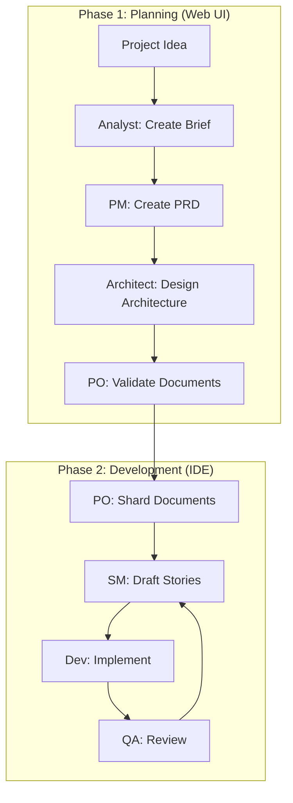

# BMAD-METHOD Integration Research Report

> **Issue**: #951 - v0.5 版本：集成 BMAD-METHOD 框架
> **Date**: 2026-03-07
> **Milestone**: M1 - 调研 BMAD-AT-CLAUDE 结构

## Executive Summary

This research report analyzes the BMAD-METHOD (Breakthrough Method for Agile AI-Driven Development) and its Claude Code integration (BMAD-AT-CLAUDE) to determine the best approach for integrating BMAD concepts into disclaude.

**Key Findings**:
1. BMAD provides a mature multi-agent collaboration framework with specialized roles (PM, Architect, Dev, SM, QA)
2. The Claude Code integration uses a message queue architecture for concurrent agent sessions
3. disclaude's existing skill system is well-suited for adopting BMAD agent patterns
4. Recommended approach: **Hybrid integration** - adopt BMAD agent roles as disclaude skills while preserving platform-specific features

---

## 1. BMAD-METHOD Overview

### 1.1 Core Philosophy

BMAD (Breakthrough Method for Agile AI-Driven Development) is a methodology that transforms AI coding assistants into complete AI development team collaboration models.

**Key Innovations**:

| Innovation | Description |
|------------|-------------|
| **Agentic Planning** | Dedicated agents (Analyst, PM, Architect) collaborate to create detailed PRDs and Architecture documents |
| **Context-Engineered Development** | Scrum Master transforms plans into hyper-detailed development stories with full context |
| **Two-Phase Approach** | Eliminates planning inconsistency and context loss - the biggest problems in AI-assisted development |

### 1.2 Agent Role System

BMAD defines specialized agent roles:

| Agent | Role | Key Responsibilities |
|-------|------|---------------------|
| **Analyst** | Research & Brief | Market research, competitor analysis, project brief creation |
| **PM** (John) | Product Manager | PRD creation, feature prioritization, stakeholder communication |
| **Architect** | System Designer | Architecture design, tech stack decisions, system diagrams |
| **UX Expert** | Frontend Design | Frontend specs, UI prompt generation |
| **PO** | Product Owner | Master checklist validation, document alignment |
| **SM** (Bob) | Scrum Master | Story creation, epic management, agile process guidance |
| **Dev** (James) | Developer | Code implementation, debugging, refactoring |
| **QA** | Quality Assurance | Code review, testing, validation |

### 1.3 Workflow Structure

BMAD follows a two-phase workflow:



---

## 2. BMAD-AT-CLAUDE Architecture Analysis

### 2.1 Directory Structure

```
bmad-claude-integration/
├── core/                      # Core system components
│   ├── message-queue.js       # Async message handling
│   ├── elicitation-broker.js  # Interactive Q&A management
│   ├── session-manager.js     # Concurrent session handling
│   └── bmad-loader.js         # BMAD file loader
├── routers/                   # Generated router subagents
├── hooks/                     # Claude hooks
├── installer/                 # Installation scripts
└── tests/                     # Test suites
```

### 2.2 Key Technical Components

**Message Queue System**:
- Handles asynchronous communication between agents
- Preserves full context in structured messages
- Supports retry logic and TTL management

**Elicitation Broker**:
- Manages interactive Q&A phases
- Tracks elicitation history per session
- Enables natural conversation flow

**Session Manager**:
- Handles multiple concurrent agent conversations
- Provides clear visual differentiation between agents
- Manages session switching and suspension

### 2.3 Agent Definition Format

BMAD agents are defined in markdown with YAML frontmatter:

```yaml
---
agent:
  name: John
  id: pm
  title: Product Manager
  icon: 📋
  whenToUse: Use for creating PRDs, product strategy...
persona:
  role: Investigative Product Strategist
  style: Analytical, inquisitive, data-driven
commands:
  - help: Show commands
  - create-prd: Create PRD from template
dependencies:
  tasks:
    - create-doc.md
  templates:
    - prd-tmpl.yaml
---
```

---

## 3. disclaude Skill System Analysis

### 3.1 Current Skill Structure

disclaude uses a skill system based on `SKILL.md` files:

```
skills/
├── evaluator/SKILL.md
├── executor/SKILL.md
├── deep-task/SKILL.md
├── schedule/SKILL.md
└── ...
```

### 3.2 Skill Definition Format

```yaml
---
name: skill-name
description: Skill description
allowed-tools: [Read, Write, Bash]
disable-model-invocation: true
---

# Skill Title

Instructions for the skill...
```

### 3.3 Key Differences from BMAD

| Aspect | BMAD | disclaude |
|--------|------|-----------|
| **Agent Format** | YAML + Markdown | YAML frontmatter + Markdown |
| **Command System** | `*command` syntax | `/command` syntax |
| **Dependencies** | Explicit file references | Implicit file access |
| **Session Management** | Message queue system | Native context |
| **Elicitation** | Dedicated broker | Natural conversation |

---

## 4. Integration Strategy

### 4.1 Recommended Approach: Hybrid Integration

**Rationale**:
- disclaude's skill system is mature and well-integrated with Feishu platform
- BMAD's agent roles and workflows can be adapted as disclaude skills
- Platform-specific features (Feishu integration) should be preserved

### 4.2 Proposed Implementation

#### Phase 1: Core Agent Skills (M2)

Create BMAD-inspired skills in disclaude:

```
skills/
├── bmad-pm/SKILL.md          # Product Manager
├── bmad-architect/SKILL.md   # Architect
├── bmad-sm/SKILL.md          # Scrum Master
├── bmad-dev/SKILL.md         # Developer
└── bmad-qa/SKILL.md          # QA Reviewer
```

Each skill would:
- Define the agent's role and persona
- Include relevant templates and checklists
- Support BMAD-style commands via `/bmad-*` syntax

#### Phase 2: Workflow Integration (M3)

Implement BMAD workflow patterns:

1. **Planning Workflow**:
   - `/bmad-pm create-prd` - Create PRD
   - `/bmad-architect design` - Create architecture
   - `/bmad-po validate` - Validate documents

2. **Development Workflow**:
   - `/bmad-sm draft-story` - Create story from epic
   - `/bmad-dev implement` - Implement story
   - `/bmad-qa review` - Review implementation

#### Phase 3: Context Engineering (M4)

Implement BMAD's context engineering approach:

1. **Story Sharding**: Split PRD/Architecture into story-sized chunks
2. **Context Injection**: Load only relevant context per task
3. **Dev Load Files**: Configure which files to always load for dev agent

#### Phase 4: Templates & Checklists (M5)

Port BMAD templates and checklists:

```
data/bmad/
├── templates/
│   ├── prd-tmpl.yaml
│   ├── architecture-tmpl.yaml
│   └── story-tmpl.yaml
├── checklists/
│   ├── pm-checklist.md
│   ├── story-draft-checklist.md
│   └── story-dod-checklist.md
└── tasks/
    ├── create-doc.md
    ├── shard-doc.md
    └── create-next-story.md
```

### 4.3 Technical Considerations

**Advantages of Hybrid Approach**:
1. Preserves disclaude's Feishu integration
2. Maintains compatibility with existing skills
3. Allows gradual adoption of BMAD concepts
4. Leverages disclaude's native context management

**Challenges**:
1. Different command syntax (`*` vs `/`)
2. Need to adapt templates to disclaude's format
3. Session management differences

---

## 5. Implementation Roadmap

### M1: Research (Complete)
- [x] Analyze BMAD-AT-CLAUDE structure
- [x] Document core concepts
- [x] Propose integration strategy

### M2: Core Agent Skills
- [ ] Create bmad-pm skill
- [ ] Create bmad-architect skill
- [ ] Create bmad-sm skill
- [ ] Create bmad-dev skill
- [ ] Create bmad-qa skill

### M3: Workflow Integration
- [ ] Implement planning workflow
- [ ] Implement development workflow
- [ ] Add document sharding capability

### M4: Context Engineering
- [ ] Implement story sharding
- [ ] Configure dev load files
- [ ] Add context injection

### M5: Documentation
- [ ] Port templates
- [ ] Port checklists
- [ ] Create user guide
- [ ] Add examples

---

## 6. References

- [BMAD-METHOD Official Repository](https://github.com/bmad-code-org/BMAD-METHOD)
- [BMAD-AT-CLAUDE Adapter](https://github.com/24601/BMAD-AT-CLAUDE)
- [BMAD Method: From Zero To Hero](https://medium.com/@visrow/bmad-method-from-zero-to-hero-1bf5203f2ecd)
- disclaude SKILL_SPEC.md

---

## Appendix A: BMAD Agent Commands Reference

### PM Agent Commands
| Command | Description |
|---------|-------------|
| `*help` | Show available commands |
| `*create-prd` | Create PRD from template |
| `*shard-prd` | Shard PRD into epics |
| `*yolo` | Toggle YOLO mode |

### Architect Agent Commands
| Command | Description |
|---------|-------------|
| `*help` | Show available commands |
| `*create-architecture` | Create architecture document |
| `*yolo` | Toggle YOLO mode |

### SM Agent Commands
| Command | Description |
|---------|-------------|
| `*help` | Show available commands |
| `*draft` | Draft next story |
| `*correct-course` | Course correction |

### Dev Agent Commands
| Command | Description |
|---------|-------------|
| `*help` | Show available commands |
| `*run-tests` | Execute tests |
| `*explain` | Explain recent changes |

---

*This report completes Milestone M1 of Issue #951*
