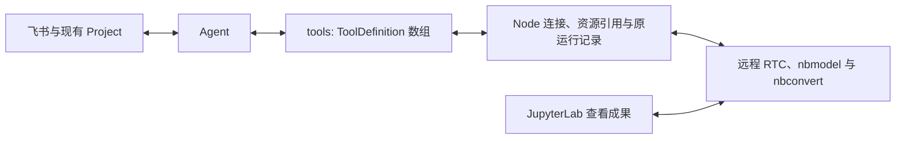

# 0.6.3：基于 Datalayer 接口持续使用远程 Notebook

2026-10-06 按用户要求调整交付路线。[综合 issue #5214](https://github.com/hs3180/disclaude/issues/5214) 跟踪持久 Project 与真实飞书产品验收。[Datalayer 实测矩阵](./datalayer-mvp.md)记录了已通过的组件和六个实际失败条件；历史实验与失败保留在 [证据记录](./jupyter-harness-evidence.md)及对应 PR 中。计划、实验、工程检查与产品验收分别记录。

同日用户明确调整范围：「手工修改支持不需要在0.6.3交付和验收」。JupyterLab 手工参数/Markdown 修改、未保存人工编辑后的模型续行及其人工操作验收移出本版门槛。现有 RTC 编辑保留机制和相关探针继续保留，不能把移出范围记为人工验收通过。最新候选、真实飞书和设备反馈见 [验收记录](../releases/0.6.3-acceptance.md)。

## 用户体验

用户在已绑定 Project 的飞书话题中提出问题。Agent 在配置的远程 Jupyter 上使用同一份 Notebook，逐步写入分析、图表、来源和结论，并给出可访问入口。在原话题继续请求后，Agent 沿用原 Notebook 和已核验的 kernel 状态，修订同一研究。JupyterLab 手工编辑后协作续行作为后续能力单独验收。

关闭浏览器仍能执行并保存。停止、断连或重启后查询原运行，明确完成、失败、仍运行或未知。成果交付为同版本的 Notebook、HTML 和飞书摘要。

## Datalayer 接口与责任

本版复用用户已有 Datalayer/Jupyter 部署，使用薄 Node 适配层。不以安装 `disclaude_jupyter`、激活 `/api/disclaude` 或合并旧 coordinator PR 链为前置。连接与只读诊断已默认选择 Datalayer，显式 `backend: "coordinator"` 保留旧后端及 cookie 身份。#5216 负责引用兼容、远端部署/回退与串行执行入口；接口可用和实际产品验收分别记录。Lab 原生客户端的路由修复与工程探针保留，人工编辑协作的产品验收按上述范围调整后续进行。

业务只定义一份工具：名称、说明、输入/输出 Schema 和 `execute(input, context)`。`context` 提供取消信号及可选进度。接入细节见 [Agent 工具契约](./agent-tools.md)：DSH 原生 registry、Codex dynamic function、Pi 原生工具、Claude 内部 MCP 包装均由 adapter 负责。内置工具与外部 MCP 使用 Harness 自己的配置；公共查询接口不再要求业务选择工具来源或创建 SDK 对象。

DSH 是主要真实验收路径，其他现有适配器复用同一业务定义。首版不要求先完成所有 Harness 的真实验收。模型路由、Session ID 和调用 ID 属于 adapter；它们不成为 Notebook 身份或执行权限。

Project 只保存远程连接、Notebook 引用和恢复所需的执行记录。Notebook、kernel、Python 依赖及输出由远程 Jupyter 管理。disclaude 宿主只用 Node 客户端，不启动本地 Jupyter、不安装 Python 环境，也不同步整个 Project。

| 接口                                                        | 本版用途与边界                                                                                                                |
| ----------------------------------------------------------- | ----------------------------------------------------------------------------------------------------------------------------- |
| `/mcp` JSON-RPC                                             | 能力发现和已验证工具；按实际 handler/schema 调用，不用占位 REST 路径冒充执行。当前缺少 `tasks/*` 只作能力诊断，不是发行阻塞。 |
| 原生 RTC / YNotebook、文件身份                              | 读取未落盘但已同步编辑，按稳定 cell ID 修改；改名同身份、复制新身份。MCP 读取是否 live 独立核验，不以落盘内容冒充共享状态。   |
| nbmodel `POST /api/kernels/{id}/execute`                    | 提交实际源码与 document/cell 元数据，保存 202 返回的原请求 Location，不另建执行协议。                                         |
| nbmodel `GET/DELETE /api/kernels/{id}/requests/{requestId}` | 原请求状态、输出和停止；修复消费式 GET 和取消目标问题，204/AbortSignal 不算停止确认。                                         |
| Sessions / kernel channels                                  | 选用远端 kernelspec，核验 Notebook/kernel 关联及原生 incarnation；宿主不自建完整 IOPub 执行与写回层。                         |
| Contents / nbconvert                                        | 远端文件、同版本交付快照和官方 HTML 导出；日常编辑走 RTC，不整份 PUT 覆盖 live Notebook。                                     |

当前可复验基线是 MCP 2.2.3、nbmodel 0.2.9、Lab/Server 4.6.4/2.21.1、collaboration/server_ydoc/pycrdt 5.0.4/3.0.4/0.14.8。这是实测组合，不是所有依赖的永久精确版本门禁。缺接口、认证失败、配置缺口与未验证版本分别诊断。

## 必须保留的行为

- 文档按远程服务和稳定文档身份关联；改名更新路径，复制产生独立身份。解除关联保留远程成果，切换 Project 不沿用旧授权。
- Agent 按 cell ID/sourceHash 定点提交，拒绝观察到的旧补丁，返回最新状态；其他 cell、metadata/附件保留。已实现的共享文档读取与人工内容保留有独立工程证据，手工修改协作移出本版产品门槛。真正同时修改同 cell 时，客户端哈希检查不提供服务端原子 CAS。
- 首版 Python、单个 disclaude Service writer；kernel 绑定原 Notebook，不复用其他 Notebook 的 kernel，不自动接管归属不明的运行。人工和 Agent Run 进入已验证的 Datalayer 服务端串行入口；停止当前、排队或已完成请求均不能影响另一运行。
- 每次执行记录原文档/cell/源码版本、kernel incarnation 和 runId。服务端接收 shell/IOPub、关联 parent message，处理 MIME/display 更新/clear/error并保存输出；源码变更后历史输出仍可查，但不能当作新版有效结果。
- Agent 取消阻止新工具操作并等待回调结束。远程运行通过原 runId 单独停止并核验实际执行；推理结束或收到 AbortSignal 不算 kernel 已停止。
- 断连、超时和重建先对账原运行；未知提交不自动重放。没有记录不等于没有执行，不返回缺少证明的 not_started。Jupyter/kernel 重启允许报告结果未知或内存丢失，不承诺自动恢复 Python 内存。
- 大输出采用有限预览和产物引用，明确截断。图表保留原生 MIME，飞书提供关键静态预览；报告、导出和摘要绑定同一文档版本及已确认结果。
- 凭据只留在宿主配置，不进入模型、Project 引用或交付链接。Notebook 访问沿用 Jupyter 授权；实际设备可达的入口才算交付。HTML 预览需满足已记录的 sanitizer/CSP 条件，下载与浏览器预览分别验证。

多 Service writer、服务端 owner generation/强制交接隔离、原子编辑事务、永久 run-ID fence 改由 [#5267](https://github.com/hs3180/disclaude/issues/5267) 按具体用例评估，不纳入 0.6.3 milestone。跨系统副作用 exactly-once、MCP Tasks、所有 Harness 的真实验收、完整 widgets/comm 导出也不是本版前置。这些范围调整不把已复现的保存、误停止或输出错误记为通过。

## Issue 分工与工程依赖

| Issue | 交付与验收责任                                                             | 工程依赖                               |
| ----- | -------------------------------------------------------------------------- | -------------------------------------- |
| #5215 | 复用统一工具契约与 DSH 会话/取消，核验结构化结果和跨进程续行               | 已合并 #5244；与连接任务并行           |
| #5216 | Datalayer 连接、认证/能力检查、已有远端部署/回退、Lab Run 服务端入口       | 独立起步                               |
| #5217 | Project 引用、live RTC、cell 编辑、改名/复制及 Project 权限边界            | #5216                                  |
| #5218 | nbmodel 执行适配、原运行日志/incarnation、可靠停止，集成下表五个服务端修复 | #5216、#5217、五个修复子任务           |
| #5219 | 原 Project/飞书话题的读改运行、实际 `/stop`、同 kernel 续行和附件输入      | #5215、#5217、#5218                    |
| #5220 | 可读研究正文、图表观察、大输出产物、同快照 HTML/ipynb/飞书交付             | #5217、#5218；与 #5219 并行            |
| #5221 | 最终持久 Project/飞书体验、故障诊断、干净 kernel 复现与源码发行            | #5215–#5220；保留 #5193 的引用卡片验收 |

这些是工程分工，不是用户研究流程。复用现有 Project、会话与附件交付；不增加研究项目注册表、固定研究阶段或通用插件工厂。远程 Jupyter 的文档/执行协调只补实际用例所需的缺口。

六个实测缺口拆成五个可独立复验的子任务，挂在 #5218 下。优先使用受支持配置或修改现有 Datalayer/Jupyter 组件；必要补丁固定来源、版本与回退路径，不建设新的通用 coordinator。

| 子任务                                                            | 交付内容                                                                | 独立验收                                                                                                |
| ----------------------------------------------------------------- | ----------------------------------------------------------------------- | ------------------------------------------------------------------------------------------------------- |
| [#5262](https://github.com/hs3180/disclaude/issues/5262) 后台保存 | 文档生命周期；先验证 RTC retention，必要时补执行期间加载/保留与结束保存 | 所有文档客户端退出并超过当前清理期，原运行完成且输出落盘；重开可见，无宿主补写                          |
| [#5263](https://github.com/hs3180/disclaude/issues/5263) 结果留存 | 原结果在明确保留期内非消费读取，原身份关联与过期/丢失诊断               | 重复 GET、其他消费者先读取、宿主进程重建均恢复原请求；无额外执行 POST；过期不伪称未执行                 |
| [#5264](https://github.com/hs3180/disclaude/issues/5264) 目标取消 | queued/running/finished 的目标取消，协调中断与下一请求派发              | 取消 queued B 不停 A；取消 finished A 不停新 B；running A 原终态确认且 kernel 可继续；覆盖完成/停止竞态 |
| [#5265](https://github.com/hs3180/disclaude/issues/5265) 源码归属 | 执行源码版本与输出归属，旧结果仅留作原运行历史                          | 执行中改代码、删除/重排 cell、同 cell 后续运行不把旧结果附为新结果，原历史仍可查                        |
| [#5266](https://github.com/hs3180/disclaude/issues/5266) 输出语义 | 原生 display_id 更新与 clear_output(wait) 语义                          | 单/多位置更新；wait=true 保留旧输出至下一输出，wait=false 立即清空；stdout/stderr/error 不退化          |

连接合同、SDK 基础和五个修复器可分别推进；资源与修复器完成后集成执行，飞书闭环与报告交付并行，最后验收最终候选。上游修复在本仓库跟踪，在用户现有远端复验；尚未向上游发布的补丁不能记为已交付。

## 当前证据与旧 PR

已通过记录环境中的 live 编辑、同 kernel 计算、真实 DSH 69→93、独立 Node 恢复 pending/未缓存 terminal 原请求而不重跑、静态 PNG/HTML、改名/复制身份和 metadata/附件保留。后续真实 Service/飞书已核验入站 CSV、目标 `/stop`、同 kernel 续行、同版本报告和引用卡片；用户确认旧报告可打开且整体无异常。最新冻结运行源码、历史失败、待验证条件及原服务恢复状态见 [验收记录](../releases/0.6.3-acceptance.md)。

已合并 #5244（工具/DSH）、#5230（引用卡片）、#5241（Codex 收尾）和 #5256（部署注释）保留；#5193 产品验收不因合并自动通过，#5222 的既有关闭记录不改变。

#5245–#5250 不再作为整条发行前置链：#5245 的自研协调层、#5248 的旧精确栈门禁和 #5249 的永久 fence 留作历史/后续参考；#5246 的 Project/Service、#5247 的宿主认证、#5250 的探针按新 issue 范围抽取通用部分并分别评审。旧工程/失败证据保留，不自动关闭或合并。#5257 继续为 Draft 发行准备，须更新为新的交付来源。

## 产品验收

- [ ] 真实飞书提出问题，在远程 Notebook 形成代码、图表、来源和结论；同一话题返回同一文档。
- [ ] 定点编辑、观察到的过期补丁、不同 cell 修改、metadata/附件、改名/复制及 Project 切换按约定工作；不把客户端检查记为原子保证。
- [ ] 五个服务端子任务的六个失败条件全部复验；串行执行入口、源码改变不混用旧结果、MIME/display/clear/error 处理正确。Lab/Agent 入口保留工程核验，人工协作体验后续验收。
- [ ] 关闭所有 Notebook 页面仍能完成并保存；实际 `/stop` 确认目标运行结束，随后在同一 kernel 继续研究。
- [ ] Agent 进程重建、网络/认证失效与 kernel/Jupyter 重启分别对账原身份，不盲目重放；无法证实内存时报告丢失/未知，不生成本地替代品或删除远程成果。stdin 有已验证的支持方式或明确拒绝，不静默挂起。
- [ ] 无共享磁盘和 Project 本地 Notebook 时完成同版本 `.ipynb`/HTML/飞书摘要交付；渲染核验 Markdown/公式、表格、PNG/SVG、HTML 及至少一个 Plotly 示例。大输出有限预览有截断提示和完整产物引用；实际设备可打开，HTML 预览满足 sanitizer/CSP 条件。
- [ ] 明确数据/环境/种子后以干净 kernel 核验复现范围；不可复现的条件如实说明。纯定性研究保留来源与论证，无需强制计算。
- [ ] 最终候选的构建、回归、安装、兼容性和恢复检查通过；模拟、组件证据与产品验收分别记录。

当前用户实例的 Datalayer 接口已完成组件复验，认证与服务健康；不再把缺少协调扩展当作此路线的前置阻塞。配置调整、上游补丁、真实产品验收与最终工程检查仍待各任务完成，详见实测矩阵。

以上清单描述正式发布前的要求；逐项候选状态以验收记录为准。用户手工修改已移出范围，不等待人工编辑窗口，也不声称该能力已经通过人工验收。

日常与候选默认 `gpt-6-luna`，禁止 Astra；#5215/#5219 真实模型验收显式 `gpt-5.6-luna` 并记录实际路由。生产短切保留配置/workspace、单机器人连接，验收后恢复并核验健康。PR 合并由用户执行。
