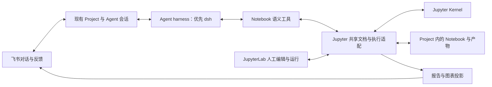

# 0.6.3：以 Notebook 为第一公民的 Jupyter Harness

状态：设计提案，尚未实现或通过产品验收。目标版本 0.6.3。当前代码基线为 `3a446d9b`；dsh 接入选择须通过下述 G0 验证后锁定。

## 产品定位

**飞书是主要交互入口，Notebook 是持续演进的研究正文、计算现场和可视化成果。人和 Agent 可以接续编辑、执行同一本 Notebook。**

用户在现有 Project 中描述问题、补充材料、讨论结论、要求继续或停止；Agent 在 Project 的 Notebook 中调查、分析、制作图表并组织论证。用户可以随时打开 JupyterLab 修改代码、参数、文字或图表，再回飞书继续。Notebook 在研究过程中始终可见、可读、可编辑，无需等到最终导出。

这里的原生支持包括文档、执行、观察和协作语义：Agent 理解 cell、当前代码对应的执行结果、人工改动、内核状态及报告结构。研究策略仍由 Agent 随问题选择，不增加固定研究阶段、独立 Research Project、任务数据库或 `/research` 模式。

## 一条完整的用户体验

1. 用户在已绑定 Project 的飞书话题里提交数据：“比较两个方案，解释差异，给我图表和结论。”
2. Agent 建立同一 Project 中的 Notebook，给出稳定入口；正文逐步形成问题、资料与方法、图表及解释、结论和限制。章节按问题调整，不强制模板。
3. 飞书展示简短的关键进展和图表预览。Notebook 保存完整代码、表格、引用与可交互图表；探索细节可以折叠或放在其他 Notebook，主报告保持可读。
4. 用户打开 Notebook，修改筛选参数和一段解释文字。Agent 读取共享文档中的最新改动；下一次修改或执行必须基于这个版本，并保留人工文字。
5. 用户回飞书说“按我改的继续”。Agent 核验变化、执行必要实验、比较前后结果，修订同一份报告；说明结论改变的原因。
6. 长实验可以停止；恢复时说明计算是否仍在、哪些结果有效、哪些需要重跑。关闭浏览器不会终止研究，切换聊天或模型不会隐式重启内核。
7. 交付同一 Notebook 入口、关键结论与图表，可下载 `.ipynb` 和对应版本的 HTML 报告。飞书文档作为按需派生成果，避免同时维护两个权威正文。

## 架构决策

优先采用 **dsh 原生插件 + Jupyter Server/JupyterLab + 共享文档与执行适配层**。Notebook 能力独立于 Agent 后端；优先复用现有 Jupyter 扩展，只有验收缺口需要自行补齐。

| 层次 | 职责 | 边界 |
| --- | --- | --- |
| Project/飞书 | 现有目录绑定、上下文、委托、追问、进展、入口 | 不新增研究项目注册表或固定研究流程 |
| Agent harness | 推理、上下文管理、工具编排、模型与对话续行 | 不持有 Notebook 的唯一副本或内核唯一控制权 |
| Notebook 适配 | 共享文档读写、版本校验、执行关联、结果提交、事件补读 | 只维护文档/计算所必需的资源记录，不扩成研究任务系统 |
| Jupyter | 内核与会话、协议通道、Notebook 编辑和渲染 | RTC、后台执行和模型会话恢复是不同能力，须逐项验证 |
| 报告与交付 | 保留原生 MIME；飞书摘要/图表；同版本导出 | 导出成功、文件保存成功、飞书送达分别报告 |

优先把共享文档与执行桥接放进现有 Jupyter Server 扩展及少量 JupyterLab 插件；disclaude 只持有连接、工具适配和 Project 绑定。不要预先增加常驻研究服务或自建 Notebook 编辑器。G0 先选择并固定一条发行主路径，优先验证按需启动的受管理 Jupyter；连接用户现有实例列为兼容性验证后的扩展。普通聊天安装不应强制安装 Python 科学计算环境。资源记录区分托管与外部实例，服务退出只能回收确实由自身创建且仍拥有的资源，不能关闭人的 Jupyter 或其他 kernel。

建议最小组件是 JupyterLab、Jupyter Server、`jupyter-collaboration`、Python/ipykernel；共享文档适配候选为 `jupyter_ydoc`/`pycrdt`，执行客户端复用 `jupyter_client` 或 `@jupyterlab/services`，以 `nbformat` 校验成果、`nbconvert` 导出 HTML、`nbclient` 做复现验证。G0 固定一组实际兼容的版本，不自行重写 kernel WebSocket 协议。[Jupyter REST](https://jupyter-server.readthedocs.io/en/latest/developers/rest-api.html)、[WebSocket 协议](https://jupyter-server.readthedocs.io/en/latest/developers/websocket-protocols.html)、[nbconvert](https://nbconvert.readthedocs.io/en/latest/config_options.html)

### 为什么优先 dsh，但不直接沿用现有适配器

dsh 的 Cordis 插件架构允许组合模型、工具、Agent loop、持久会话和 hooks，适合实现理解 Notebook 的工具集；官方仍将其列为 developer preview，需要固定并验证版本。[官方架构](https://github.com/deepseek-ai/deepseek-harness/blob/639ed015397290b3745d163aafe02ffee4aa3f84/docs/architecture.md)、[项目说明](https://github.com/deepseek-ai/deepseek-harness)

本机 `@deepseek-ai/dsh@0.1.2-rc.1` 与核对的上游 `639ed015` 暴露了两层不同的能力：

- 底层有原生工具注册、持久 Session、Agent resume/cancel 和模型适配接口，可用于插件组合。
- 当前上游 SDK 请求分派只有 `initialize`、`session/prompt`、`shutdown`。disclaude 当前 dsh provider 拒绝客户端 inline/MCP 工具注册、每个 query 新建随机 Session，并固定 `deepseek-official` provider；取消会释放 dsh 进程。不能据底层存在能力宣称当前接入已有恢复和中断。[上游 SDK](https://github.com/deepseek-ai/deepseek-harness/blob/639ed015397290b3745d163aafe02ffee4aa3f84/packages/sdk/server/src/server.ts)、[当前适配器](../../packages/core/src/sdk/providers/deepseek/provider.ts)
- 当前事件适配会将工具结果转换为文字，不能承载完整 Notebook MIME 和执行身份。[事件适配器](../../packages/core/src/sdk/providers/deepseek/event-adapter.ts)

因此优先验证独立的 **notebook 插件组合/profile**，通过 dsh 原生服务加载工具与必要的控制适配；这只是 harness 配置，不增加用户可见的“研究模式”。保持现有 dsh 用途兼容，不直接替换全局 profile。dsh 内置 `run_code` 的独立 Node worker 不能替代持久 Jupyter kernel。

需要新增的控制能力应尽量通过插件和受版本约束的窄接口实现，并考虑贡献上游。若必须长期 fork dsh 核心 loop，或当前环境的指定模型路由无法可靠工作，就改用现有 Codex backend，通过同一 Notebook CLI/能力接口完成 0.6.3；现有 Codex adapter 也未实现统一 inline/MCP 注册，不能把“换后端”描述成零成本开关。

### 其他方案的位置

| 方案 | 值得复用的部分 | 对本需求的判断 |
| --- | --- | --- |
| dsh 原生插件 + Jupyter | 可组合 Agent loop、Notebook 语义工具与原生内核 | 首选验证；重点验证模型、工具、取消和续行的真实路径 |
| 现有 Codex backend + 同一 Notebook 接口 | 已有飞书交互与 Agent 运行路径 | dsh 验证不满足条件时的替代；共享文档和内核成果保留 |
| 现成 Jupyter MCP/工具扩展 | cell 编辑、运行、输出、Jupyter 连接与同步 | 优先评估复用；MCP 是工具传输，不能自动解决未保存改动、后台执行、恢复和冲突 |
| Jupyter AI | JupyterLab 的 AI 扩展生态和工具协议 | 可提供补充入口；飞书仍是本产品主要对话入口 |
| nbclient / Papermill | 干净内核重跑、参数化验证、批量执行 | 用于复现检查和批处理，不承担实时人机协作 |
| marimo | 响应式依赖和交互式应用体验 | 若未来接受改变主要文档/运行语义再考虑；0.6.3 先保证原生 `.ipynb` 工作方式 |

参考：[Jupyter AI](https://github.com/jupyterlab/jupyter-ai)、[Jupyter MCP Server](https://github.com/datalayer/jupyter-mcp-server)、[nbclient](https://nbclient.readthedocs.io/en/latest/)、[Papermill](https://papermill.readthedocs.io/en/latest/)、[marimo](https://docs.marimo.io/)。具体扩展版本和可复用范围在 G0 锁定；项目 README 的能力列表不作为验收证据。

复用验证优先比较 Datalayer 的 `jupyter-mcp-server` 与社区 `jupyter-server-mcp`/`jupyter-ai-tools`。后者当前 Notebook 工具源码存在“无 RTC 时依赖浏览器 live model、RTC 时从磁盘读取而向共享文档写入”的分支，不能直接保证无人打开页面及未落盘人工修改两种场景。Datalayer 的 durable execution 也需区分本地 Jupyter 和其云执行后端。`jupyter-ai-contrib` 不是官方 Jupyter 子项目，这些是候选项目的第一手证据，不是官方兼容性保证。[工具源码](https://github.com/jupyter-ai-contrib/jupyter-ai-tools/blob/main/jupyter_ai_tools/toolkits/notebook.py)、[Server MCP](https://github.com/jupyter-ai-contrib/jupyter-server-mcp)、[组织说明](https://github.com/jupyter-ai-contrib)

## 必须成立的 Notebook 契约

### 文档身份与人工修改

- Notebook 存在于当前 Project 的实际工作目录中。资源身份至少包含规范化 Project 根目录、Notebook 稳定 ID 和受校验路径；不能仅用聊天 ID、目录 basename 或文件名作为身份。复制 Notebook 时须识别重复 ID；改名保留身份，移动越过 Project 边界须重新绑定。
- 活跃共享文档是在线编辑的权威状态，`.ipynb` 是持久、可移植成果。Agent 必须读到 JupyterLab 中已同步但尚未保存到文件的修改。磁盘 `read → 改 JSON → 整文件写回` 不能作为在线协作实现。
- 采用稳定 cell ID 和 cell/文档版本校验进行定点修改，保留未知 metadata 和附件。不同 cell 的并发改动可以合并；同一 cell 内容已改变则拒绝旧补丁、返回最新片段，由 Agent 重新理解。CRDT 合并不等于语义上可以覆盖人工改动。
- 版本检查与提交必须在同一受控操作中完成。外部客户端或原始文件编辑若绕过共享层，先识别并解决状态差异，不能宣称支持任意编辑器的无冲突协作。
- 人工修改无需每敲一个字唤醒模型。把变化合并成有界通知；Agent 在下一次读取、写入或执行前刷新上下文。已有研究活跃时可在步骤边界吸收变化，空闲时等待飞书续行。
- 人工可接管执行：停止 Agent 自动提交新的编辑/运行，等待或中断当前执行后交还控制。保存、拒绝旧版本补丁和普通编辑不引入逐次审批。
- 首版同一本 Notebook 同时只有一个自动化控制者。其他聊天可以读和接续访问，但接续写入需完成控制权交接；不能让两个 Agent 交替改参数。排队、实际提交、结果写回和停止均检查控制者及执行身份。人工接管撤销旧控制者的提交资格，旧聊天的 `/stop` 不得中断交接后新发起的人工实验。这只是资源协调，不增加研究任务生命周期。

JupyterLab 的 shared model/RTC 解决实时文档协作的一部分；服务端执行与前端存活是独立问题，不能仅安装 RTC 就宣称浏览器关闭后仍能可靠执行并保存。核对时官方配置文档将集成的 server-side execution 标为实验特性且仅 Jupyverse 支持；普通 Jupyter Server 需要适配层持续接收输出并写入共享文档。Jupyverse 可作 G0 对照候选，经过相同恢复测试后再考虑采用。[RTC 文档](https://jupyterlab-realtime-collaboration.readthedocs.io/en/latest/)、[配置与服务端执行边界](https://github.com/jupyterlab/jupyter-collaboration/blob/main/docs/source/configuration.md)

### 执行、结果与中断

- 首版使用 Python kernel，同一 Notebook 默认独占一个 kernel，按 kernel 串行调度执行。不同 Notebook 可以独立运行。人从 JupyterLab 点击 Run 和 Agent 发起执行必须使用同一协调入口；否则应检测为外部执行并使相关状态失效，不能靠模型遵守约定保证一致性。
- 每次执行绑定 Notebook ID、cell ID、源代码 hash、kernel incarnation、请求 ID 与执行 ID。cell 被编辑、删除或重排后，旧执行结果仍可查证，但不得成为新版 cell 的有效结果。
- 完成判断要关联相同 `parent_header.msg_id` 的 shell reply 和 IOPub 状态，正确处理 `stream`、`execute_result`、`display_data`、`update_display_data`、`clear_output` 和 `error`。收到 HTTP 响应、首条输出或任何一次 `idle` 都不足以宣告指定执行成功。命令执行完成与后续异步输出更新分开记录。[Kernel 消息协议](https://jupyter-client.readthedocs.io/en/stable/messaging.html)
- 服务端接收并持久化输出，不依赖浏览器开着。Agent 工具连接中断后能够查询原执行，避免重复运行。大输出在明确配额内保存，超过配额给出可见截断与外部产物引用，不能无限增长或静默丢失。
- `display_id` 只在对应 kernel 生命周期内路由更新，可能关联多个输出位置，不作为跨重启持久身份。Jupyter 的断连消息缓冲也不能代替可恢复的执行记录。
- `/stop` 先阻止新操作，取消队列，再中断当前拥有的 kernel 执行并确认结果。Jupyter interrupt 作用于 kernel，必须确保没有误伤其他 Notebook。停止 Agent 推理和停止实验结果分别可见；确认失败时明确显示仍运行或未知。
- 内核不响应 interrupt 时报告实际状态，再按用户明确请求或已配置策略重启；重启意味着内存丢失。不要把 kill dsh 进程当作 kernel 已停止。
- 请求重试需要幂等检查，但崩溃窗口内的外部副作用不能承诺 exactly-once。结果未知的执行不自动重放，先对账，再决定是否重跑。

### 恢复与结果有效性

聊天会话、dsh Session、Jupyter Session、kernel 和 `.ipynb` 分别有生命周期。Project 切换、Agent reset 或换模型不隐式删除 Notebook、停止其他会话的计算或迁移内核。

重连时核对 kernel 身份及 incarnation；无法证明仍为原内核就标记内存状态未知。Notebook 保存的代码和输出可恢复，不代表变量、打开的连接、GPU 状态或运行中的线程可恢复。研究报告可以保留历史结果，但必须标识它们对应的代码、环境和执行。

Python 是任意有副作用的程序，首版不承诺自动精确依赖图。代码或参数变化后保守标记可能受影响的结果；Agent 解释重跑选择。需要宣称可复现时，用独立干净内核执行明确的复现范围，记录数据来源/版本、环境、随机种子与输出比较；外部实时数据造成的差异应说明，不能为了通过而覆盖旧证据。

## 面向 Agent 的能力与研究体验

下面是拟议语义接口，不是现有 Jupyter 或 dsh API 名称：

| 能力 | 输入与输出要点 |
| --- | --- |
| 打开/发现 Notebook | Project 绑定、稳定身份、目录/章节概览、kernel 与同步状态 |
| 读取/观察 | 指定 cell/章节、最新改动、结果有效性、表格摘要与按需图片 |
| 修改 | cell ID、预期版本、插入/更新/移动/删除操作；返回实际提交版本或冲突 |
| 运行 | 明确 cell 集合/顺序、源版本、执行 ID；长执行可异步跟进 |
| 查询结果/变量 | 执行状态、类型/形状/有限预览、MIME/产物引用；不把巨大对象全量塞进上下文 |
| 停止/恢复连接 | 目标 kernel 和执行、所有权、停止证据；区分重新连接与重新执行 |
| 交付/复现 | 指定 Notebook 版本与已确认结果，导出、回读、可选干净内核验证 |

Agent 默认围绕问题、数据与证据、方法选择、结果解释和结论边界组织 Notebook。重要结论邻近相关图表、cell 和来源；保留反例及判断变化。能够完成纯文献或定性研究，不为使用 kernel 而强行添加无意义代码。

初始上下文只给章节概览、近期改动、当前执行和关键结果；按需读取细节。具备视觉能力的模型可以查看关键图表原图；无视觉能力的后端取对应数据与图表说明并明确能力边界。让 notebook 组织和观察能力参与每一轮研究，不仅依赖提示词要求“最后生成报告”。

## 报告与可视化交付

- 正式 Notebook 支持 Markdown/公式、代码折叠、数据表、PNG/SVG、HTML 与至少一种交互图表（首选 Plotly）。普通阅读不需要先理解代码，细节可展开核验。
- 完整 MIME 输出保留在 Notebook 和必要产物中；飞书展示选定图表的静态预览、简洁解释和回到原 Notebook 的链接。导出 HTML 的交互能力单独测试；widgets/comm 不能假设在静态 HTML、图片或飞书中仍然可用。
- notebook 入口须从用户实际设备可达。远程部署的 localhost 链接不算交付；G0 选定可落地的既有认证入口，链接不携带可复用管理 token。首版以已有部署操作者身份访问 Notebook，飞书收到链接不自动授予编辑权限；现有 Project 没有成员 ACL，不能据目录绑定声称提供群成员权限。适配层校验文档/产物所属 Project，用户认证沿用部署入口，不顺带新建 Project 权限系统。实际设备访问是发行门槛。
- 报告和导出绑定同一文档版本及已确认执行结果；导出过程中人工继续修改时，标明所导出版本并提示有新改动。旧结果、尚未运行的代码、截断输出在阅读模式中也能辨认。
- 飞书文档按需导出或定点更新，并记录来源 Notebook 版本。首版不承诺 Notebook 与飞书文档正文的任意双向合并；飞书的反馈通过原会话进入 Notebook 修订。
- 继续复用现有 Project 与附件投递；附件操作使用已确认归属的绝对路径，避免当前文件投递工具按全局 workspace 解析相对路径造成错投。

`.ipynb` 的 MIME、cell ID 和 metadata 采用原生格式，运行记录只增补必要的命名空间字段或 Project 内部资源记录，不把完整凭据和模型对话嵌入 Notebook。[nbformat](https://nbformat.readthedocs.io/en/latest/format_description.html)

## 首版范围与实施顺序

0.6.3 的完整切片必须包含飞书发起、原生 Notebook、人工插手、图表与报告、可靠停止、同一研究重返。Python 与单 Notebook 独占 kernel 是首版默认；多语言 kernel、远程计算集群、多 Agent 共写同一 kernel、自动依赖图、任意 widgets 导出、自建编辑器和独立研究调度不作为首版要求。

| 阶段 | 可评审交付 | 通过条件 |
| --- | --- | --- |
| G0-A dsh 接入验证 | 固定 dsh 版本；原生插件、模型路由与窄控制接口 | 指定模型真实调用 notebook 工具；取消可传播；会话续行与事件身份可保留；无需侵入核心 loop。此组结果决定保留 dsh 或换 Agent adapter |
| G0-B Jupyter 能力验证 | 与 G0-A 并行；固定 Jupyter 兼容组合、发行主路径、认证入口；现成扩展对照 | 未落盘的人工编辑可读；关浏览器仍执行保存；中断、图表回读和控制权交接可核验。此组结果决定 Jupyter 扩展复用/补齐范围，不把文档或内核问题归因于 dsh |
| G1 文档与执行基础 | Project 资源绑定、shared model、kernel 生命周期、输出关联；必要的 JupyterLab 执行入口适配 | 用真实 Jupyter/ipykernel 验证版本冲突、执行完成、display 更新、取消、结果未知和跨 Project 隔离 |
| G2 Agent 与飞书闭环 | 工具、上下文变化、原话题入口、真实停止与续行 | 真实模型在原 Project 完成分析；用户直接修改 Notebook 后继续同一研究且改动保留 |
| G3 报告与可视化 | 报告组织指导、图表观察、静态预览、同版本 `.ipynb`/HTML 导出 | 核验图、表、公式与结论的实际可读性；交互图表与静态降级可用；导出与来源版本一致 |
| G4 恢复与发行 | 重启对账、按需安装/doctor、版本兼容范围、文档和发行验收 | 浏览器关闭、Agent 重启、kernel 丢失分别处理；保全成果；从支持的安装环境可重复完成真实闭环 |

这些阶段是实现与 review 的分解，不是产品强制的研究流程。G0-A/B 分别记录通过、失败和未知，再联合跑通最小链路；换 Agent backend 不能解决共享文档或内核层的失败。基础内核/协作桥和 dsh 接入在契约确定后可以并行，避免一个巨型 PR。

模型探针遵守仓库当前要求：实际加载配置、provider 路由及命令行覆盖必须显式核对为 `gpt-5.6-luna`。dsh 底层有其他模型 adapter 不等于该模型已在当前环境可运行；G0 需真实验证。此约束不是产品只支持一种模型的承诺。

## 产品验收清单

| 场景 | 必须观察到的证据 |
| --- | --- |
| 飞书 → 分析 → 报告 | 原 Project/话题产生可访问的同一 Notebook；实际代码、表格、图表和有依据的结论 |
| 人直接插手 | 用户修改参数和 Markdown；未落盘但已同步的改动可被 Agent 读到；继续后用户文字保留、图表和结论对应新参数 |
| 并发编辑与运行 | 不同 cell 改动保留；同 cell 旧补丁被拒绝；人工 Run 与 Agent Run 不争用 kernel；运行中改源码不把旧输出当新输出；控制权交接后旧会话不能修改或停止新拥有者的执行 |
| 无浏览器研究 | 关闭全部 Notebook 页面后，飞书发起执行仍能完成并保存；重新打开可见正确结果 |
| 真正停止 | 长运行 cell 在停止后有内核确认，不只聊天停止；迟到输出不导致状态变回成功；不能确认则呈现未知 |
| 进程/网络故障 | 对账原执行、无盲目重放；Agent 重启不丢 Notebook；kernel 丢失明确报告变量已不可用 |
| Project 隔离 | 两个 Project 的同名 Notebook 不共享数据/变量；切换 Project 不向旧 Notebook 写入；多聊天访问同一 Notebook 身份一致 |
| 可视化与交付 | 表格、图像、HTML/交互图均经过真实渲染检查；飞书静态预览可读；Notebook/HTML/摘要对应同一版本；手机或实际访问设备的链接可用 |
| 复现 | 在清楚的数据/环境约束下以干净 kernel 重跑，关键结论可核验；不能复现时标明原因和边界 |

协议测试、假工具和 CI 只能证明相应契约，不替代飞书入口、人直接操作 Notebook、图表阅读与续行的真实验收。UI 验收每轮先设少量操作预算，其余优先用事件、文件、协议和日志证据。生产验收沿用单机器人连接、配置/workspace 保全、候选来源与中断记录、恢复健康检查的既有约定。

## 当前交付边界

本提案已经核对现有 Project/dsh 代码和上游能力边界；尚未安装或启动候选 Jupyter，未运行真实模型、未修改生产服务，也未证明端到端体验。下一项具体工作是 G0：验证“飞书为入口的同一本 Notebook，人可直接改、Agent 能接着算和改报告”这条链路，再确定 dsh 接入与 Jupyter 扩展的最终实现。
