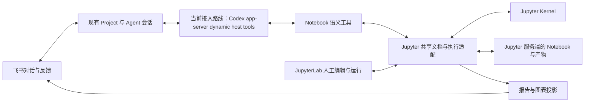

# 0.6.3：以 Notebook 为第一公民的 Jupyter Harness

状态：首版范围与实施顺序已确认，由[综合 issue #5214](https://github.com/hs3180/disclaude/issues/5214) 和 [0.6.3 milestone](https://github.com/hs3180/disclaude/milestone/18) 跟踪；尚未实现或通过产品验收。G0-A 已选择现有 Codex provider 的 app-server 动态 host tools 作为 0.6.3 接入实现路线：它已用 `gpt-5.6-luna` 实际调用一次性 Jupyter scratch 工具；dsh SDK 的隔离 profile 未配置可用的模型凭据，其默认 profile 也没有 Notebook 工具，且 SDK 协议不提供远程取消或恢复请求。该决定只锁定 Agent 接入候选，不代表共享文档、可靠停止或飞书产品验收完成。

## 产品定位

**飞书是主要交互入口，Notebook 是持续演进的研究正文、计算现场和可视化成果。人和 Agent 可以接续编辑、执行同一本 Notebook。**

用户在现有 Project 中描述问题、补充材料、讨论结论、要求继续或停止；Agent 在关联的 Jupyter Notebook 中调查、分析、制作图表并组织论证。Notebook 由选定的 Jupyter 服务保存和管理，可位于本地或远程 JupyterLab/Jupyter Server 环境，无需存在于 Project 的工作目录。Project 关联研究上下文与 Notebook 引用，不决定其存储位置。用户可以随时打开 JupyterLab 修改代码、参数、文字或图表，再回飞书继续。Notebook 在研究过程中始终可见、可读、可编辑，无需等到最终导出。

这里的原生支持包括文档、执行、观察和协作语义：Agent 理解 cell、当前代码对应的执行结果、人工改动、内核状态及报告结构。研究策略仍由 Agent 随问题选择，不增加固定研究阶段、独立 Research Project、任务数据库或 `/research` 模式。

## 一条完整的用户体验

1. 用户在已绑定 Project 的飞书话题里提交数据：“比较两个方案，解释差异，给我图表和结论。”
2. Agent 在选定的 Jupyter 服务上创建或打开 Notebook，将其引用关联到当前 Project，给出稳定入口；正文逐步形成问题、资料与方法、图表及解释、结论和限制。章节按问题调整，不强制模板。
3. 飞书展示简短的关键进展和图表预览。Notebook 保存完整代码、表格、引用与可交互图表；探索细节可以折叠或放在其他 Notebook，主报告保持可读。
4. 用户打开 Notebook，修改筛选参数和一段解释文字。Agent 读取共享文档中的最新改动；下一次修改或执行必须基于这个版本，并保留人工文字。
5. 用户回飞书说“按我改的继续”。Agent 核验变化、执行必要实验、比较前后结果，修订同一份报告；说明结论改变的原因。
6. 长实验可以停止；恢复时说明计算是否仍在、哪些结果有效、哪些需要重跑。关闭浏览器不会终止研究，切换聊天或模型不会隐式重启内核。
7. 交付同一 Notebook 入口、关键结论与图表，可下载 `.ipynb` 和对应版本的 HTML 报告。飞书文档作为按需派生成果，避免同时维护两个权威正文。

## 架构决策

G0-A 选择 **现有 Codex provider 的 app-server 动态 host tools** 作为 0.6.3 的 Agent 接入实现路线。理由是固定版本已用 `gpt-5.6-luna` 真实模型调用连接远程 Jupyter 的 scratch host tool；dsh 隔离 SDK 只验证了精确 route 可初始化，缺少可用凭据与默认 Notebook 工具，且没有远程 cancel/resume 请求。#5226 还将 app-server 的 request、tool call、thread 和 turn ID 传给 host handler，便于把 Jupyter 执行记录关联回 Agent 调用。Codex app-server API 仍属 experimental；此选型不关闭 #5215，也不证明产品工具、kernel interrupt、会话恢复或飞书闭环已通过。Notebook 能力独立于 Agent 后端；优先复用现有 Jupyter 扩展，仅补齐验收发现的缺口。

| 层次 | 职责 | 边界 |
| --- | --- | --- |
| Project/飞书 | 现有上下文、委托、追问、进展，以及 Jupyter 连接与 Notebook 引用 | Project 目录绑定不限制 Notebook 存储位置；不新增研究项目注册表或固定研究流程 |
| Agent harness | 推理、上下文管理、工具编排、模型与对话续行 | 不持有 Notebook 的唯一副本或内核唯一控制权 |
| Notebook 适配 | 共享文档读写、版本校验、执行关联、结果提交、事件补读 | 只维护文档/计算所必需的资源记录，不扩成研究任务系统 |
| Jupyter | Notebook 与产物存储、内核及其执行环境、协议通道、编辑和渲染 | RTC、后台执行和模型会话恢复是不同能力，须逐项验证 |
| 报告与交付 | 保留原生 MIME；飞书摘要/图表；同版本导出 | 导出成功、文件保存成功、飞书送达分别报告 |

优先把共享文档与执行桥接放进现有 Jupyter Server 扩展及少量 JupyterLab 插件；disclaude 只持有连接、工具适配和上下文关联。JupyterLab 是人的编辑入口，实际持久内容由其后端 Jupyter 服务的存储管理；不要求与 disclaude 同机、共享磁盘或挂载 Project 目录。不要预先增加常驻研究服务或自建 Notebook 编辑器。G0 先选择并固定一条发行主路径，优先验证按需启动的受管理 Jupyter；连接用户现有实例列为兼容性验证后的扩展。两种部署方式均遵循同一服务端存储契约，普通聊天安装不应强制安装 Python 科学计算环境。资源记录区分托管与外部实例，服务退出只能回收确实由自身创建且仍拥有的运行资源，不能关闭人的 Jupyter、其他 kernel 或删除已有 Notebook。

建议最小组件是 JupyterLab、Jupyter Server、`jupyter-collaboration`、Python/ipykernel；共享文档适配候选为 `jupyter_ydoc`/`pycrdt`，执行客户端复用 `jupyter_client` 或 `@jupyterlab/services`，以 `nbformat` 校验成果、`nbconvert` 导出 HTML、`nbclient` 做复现验证。G0 固定一组实际兼容的版本，不自行重写 kernel WebSocket 协议。[Jupyter REST](https://jupyter-server.readthedocs.io/en/latest/developers/rest-api.html)、[WebSocket 协议](https://jupyter-server.readthedocs.io/en/latest/developers/websocket-protocols.html)、[nbconvert](https://nbconvert.readthedocs.io/en/latest/config_options.html)

### G0-A 证据与接入路线选择

初始探针针对本机固定候选 `@deepseek-ai/dsh@0.1.2-rc.1` 的默认 SDK route：没有 Jupyter profile/plugin，选定的默认 provider 配置也没有 `openai-codex` route，因此在模型调用前以 `NO_ADAPTER` 结束。这个结果证明默认配置不能直接承载本需求，但不足以排除该版本 dsh 的其他原生 provider route。

2026-10-01 对同一安装做了隔离复核。标准 `sdk` profile 加载 `@deepseek-ai/dsh-llm-pi-ai`；随附 pi-ai `0.84.4` catalog 中有 `openai-codex` / `gpt-5.6-luna`，但当前用户 profile 没有启用这条 route。用仅含 provider/model 的临时 profile patch 注册该 route 后，SDK `initialize` 明确指定 `provider=openai-codex`、`model=gpt-5.6-luna`、`reasoningEffort=low`，服务端成功返回 `deepseek-harness-sdk-runtime`。这证明固定版本能解析该精确 route，不证明已认证、调用了真实模型或完成 Jupyter 工具调用。该隔离 DSH home 没有 OpenAI API key 或 `openai-codex` OAuth record，因此本轮没有发模型请求。`sdk` 与 `sdk-minimal` 的默认 profile dump 都没有 Jupyter/Notebook 插件。

取消与事件接口需按接入方式区分：SDK 提供 `session.event`（完整会话日志事件信封）和 `session.status`（running/idle）通知，但 `session/prompt` 只回传持久入队的 `messageId`，不标识最终助手回复、`turn/end` 或每个事件对应的提示词；尚未验证它与飞书消息/执行身份的关联。SDK 协议只有 `initialize`、`session/prompt` 和 `shutdown` 请求，没有远程 cancel/session-close 或 resume 方法；同一运行时可向原 session 继续排入提示词，重启后如何恢复不由该协议提供。关闭 runtime 会放弃整条 Agent runtime，不能据此宣称 Jupyter kernel 已停止。`dsh-agent` 的进程内 API 提供 create/resume/cancel/whenIdle，但尚未验证 Disclaude/飞书怎样调用该控制面，或如何把取消传递为 Jupyter kernel interrupt。基于当前可用接入能力，G0-A 选择继续实现 Codex app-server 动态 host tools；仍需产品级验证已授权连接、结构化执行结果、消息与执行关联、会话续行、分层取消和飞书集成，issue 继续保持未完成。

选定路线是在 Codex app-server 中注册动态 host tool，由 disclaude host 通过认证的 Jupyter Server API 处理请求。Codex CLI `0.159.2` 的隔离协议探针在 `initialize.capabilities.experimentalApi=true` 下，以 `gpt-5.6-luna` 调用一次 `jupyter_get_notebook`；host 读取实际 Jupyter `contents` 响应中的文档 ID、cell ID 和 marker，模型在完成回复中复述了这些值。该探针没有通过飞书运行。

后续分支验证见 [PR #5226](https://github.com/hs3180/disclaude/pull/5226)：Codex provider 的 app-server 路径现可注册 namespaced dynamic function，并将 `item/tool/call` 路由给 inline host handler。一次显式指定 `gpt-5.6-luna`、`low` reasoning 的真实模型探针读取了用户提供的 Jupyter Server 2.19.0：host 通过 Contents API 创建唯一的临时 Notebook，模型调用 `read_notebook` 后收到正确路径、cell ID 和 marker 校验；host 核验身份后删除文件，Contents API 随后返回 404。没有打开、修改或执行任何既有 Notebook，也未创建 kernel。该结果验证一次 provider-to-host-to-Contents 读取链，不验证执行身份、取消、RTC、后台运行、Feishu 或完整产品验收。

2026-10-01 14:41 CST 补做了一次 provider-to-kernel scratch 探针：在 #5226 的 Codex app-server 动态 host-tool 分支，经 Codex provider 发出一次真实模型调用，显式指定 `gpt-5.6-luna` / `low`。本轮实际加载了 `~/.disclaude/disclaude.config.yaml`，provider 日志确认该回合使用上述模型和 effort。模型调用唯一的 `run_scratch_cell` 工具；一次性实验 host handler 校验随机 probe ID，在远程用户 Jupyter Server 创建的 UUID scratch Notebook 与 `conda-base-py` kernel 上，只执行固定 `print` 标记。该请求收到匹配的 `execute_reply: ok` 与 IOPub `idle`，host 经 Contents API 写入输出并立即读回，确认 cell ID、源码和输出 marker 一致；随后 session 与 Notebook 删除均返回 204，Contents 回读为 404。没有打开 Lab 页面或触碰既有 Notebook/kernel。该探针证明候选 provider 的动态 tool dispatch 可触发一次受限远端 Jupyter kernel 执行并由 host 持久化结果；handler 是一次性实验代码，不能代表产品 Jupyter 适配器。它不证明 RTC、人工未保存编辑、Agent 管理的页面关闭执行、控制权交接、取消/迟到结果、Feishu 或完整产品闭环。

当前 `main` 仍缺这条动态工具闭环；PR #5226 分支提供 opt-in 实现。提交 `a996b0ae` 将 app-server 的 request、tool call、thread 与 turn ID 传入 inline host handler 的调用身份；定向测试、core build/type-check 和 ESLint 在本地通过，该头 GitHub CI 6/6 成功。2026-10-01 的独立双轮真实模型探针在 Codex CLI `0.159.3`、`gpt-5.6-luna/low` 下，以同一 query stream 连续输入两轮；每轮由独立 app-server 进程承载，第二轮 `thread/resume` 未携带 `dynamicTools`，但同一个 marker host tool 仍在两轮各执行一次，保持同一 thread ID、使用不同 turn ID。探针使用隔离临时 cwd 与只读 sandbox，结束后进程数归零并清理目录。这验证 Codex provider 级 thread 续接与 host tool 路由，不代表 Feishu ChatAgent 的研究会话恢复或 Jupyter 作业恢复。仍须验证请求隔离、超时/取消、Jupyter kernel interrupt、Feishu 续行和服务重启对账。不要直接将用户输入回调改成通用 MCP/工具注册入口。

Codex app-server 动态工具 API 当前标为 experimental，产品实现须固定兼容版本并明确降级行为。工具 handler 只访问已授权连接中的服务端 Notebook；不能通过本地路径或 Project `cwd` 定位，也不能把 Jupyter 管理凭据交给模型。

Jupyter 侧验证使用隔离 localhost 栈：Python `3.13.9`、JupyterLab `4.6.3`、Jupyter Server `2.21.1`、`jupyter-collaboration` `5.0.4`、`jupyter-server-nbmodel` `0.2.9`、ipykernel `7.4.0` 和 `httpx-ws` `0.9.0`。协议实验中，两名 RTC peer 同步了 Markdown 编辑；kernel 返回的 `42` 和输出写入并保存在 `.ipynb`；有效取消返回 204，过期取消返回 404 且未中断后续执行。服务重启后文件中的人工编辑和输出仍在，但原 kernel 消失，变量内存不可恢复。2026-10-02 的 API-only 探针另验证了 `jupyter_server_nbmodel` 的无浏览器执行写回：隔离服务启用 `jupyter_server_ydoc`、`jupyter_server_nbmodel` 与 `server_side_execution`，创建临时 Notebook/kernel 并连接独立 `pycrdt` Provider 后，`POST /api/kernels/{id}/execute` 返回 202，关联请求轮询到 complete；Contents API 随后读到 `execution_count=1` 和输出标记。全程没有打开浏览器页面，清理了临时 session、Notebook、server 和 root。以上证明该固定隔离组合的一条 server-side execution 路径能写回 Notebook；仍不证明真实用户服务兼容、产品 Agent/Feishu 集成、关闭并重新打开实际 Lab 页面、图表阅读或设备链接可用。

2026-10-02 在同一隔离栈做了无浏览器执行中断探针：长 cell 首先输出随机标记，随后对该 request URL 发 DELETE 得到 204；继续查询得到 HTTP 200、`request_status=complete`、execution `status=error` 和 `KeyboardInterrupt` 输出。写回的 `.ipynb` 包含开始输出与中断错误，没有迟到的打印标记；同一 kernel 随后成功运行另一个 cell。执行请求的 HTTP 200 和 `request_status=complete` 本身不代表成功，客户端还须读取 execution `status` 与错误输出。探针没有打开页面；kernel session、Notebook、隔离 server 和 root 均已清理。它验证 nbmodel `0.2.9` 的这一条中断路径，不验证 Disclaude `/stop`、控制者代次、并发所有权、Agent 断连重查或 server 重启对账。

2026-10-02 用同一隔离栈补做了实际 JupyterLab 前端 RTC 探针。独立临时 Server 使用 JupyterLab `4.6.3`、Jupyter Server `2.21.1`、`jupyter-collaboration` `5.0.4`，与长期运行的另一测试 Server、用户远程 Jupyter 和 Project workspace 分开；使用 Chromium `155.0.8057.0` 无头打开同一个 scratch Notebook 的两个页面。两页各自建立 collaboration room WebSocket。第一页通过编辑器将 cell 从 `# ORIGINAL_NOTE` 改成 `# HUMAN_EDIT_NOT_YET_SAVED`；第二页实时读到该修改，而紧接着读取 Contents API 仍只返回原文。YDoc 保存延迟设为 30 秒，以明确区分共享内存状态与已落盘 Notebook。随后一个独立 Python `pycrdt` `Provider`/`Channel` 客户端以同一服务认证连接该 room，通过 `YNotebook` 读取到了同一 cell ID 和未保存源码；peer 连接和源文本匹配均成功，读取前后 Contents API 仍返回原文。这验证真实 JupyterLab 前端修改会进入同一协作文档，并在 Contents 保存前对另一个前端及协议 peer 可见；协议 peer 不是 disclaude 产品 host adapter，也未验证用户远程服务，因此不能据此宣称产品 Agent 已接通 RTC。页面自动产生的 1 个 notebook session 与唯一 scratch 文件按路径清理，隔离 Server 停止后删除了整棵临时 root；随后核查没有 `disclaude-063-rtc-ui-*` 临时目录残留。原有长运行隔离 Server 未触碰。本轮 UI 操作预算为 4，实际仅打开两页、编辑一次并观察一次同步；pycrdt peer 连接与 Contents 检查走协议/API。

2026-10-01 的用户 Jupyter 服务补充了一次远程执行协议探针：服务报告 Jupyter Server `2.19.0`，Python kernelspec 为 `conda-base-py`；基线为 9 个 kernel/session。没有打开任何 JupyterLab 页面，也没有读取、修改或执行既有 Notebook。通过 Contents API 创建 UUID 临时 Notebook 和新 session/kernel，协商 `v1.kernel.websocket.jupyter.org` 后只执行一个 `print` 标记；同一请求收到 `execute_reply: ok`、匹配的 IOPub `idle` 与 stdout。随后由探针通过 Contents API 保存输出并回读，确认 cell ID、源码和输出一致。清理前核验了临时 cell 身份，session 和 Notebook 删除均返回 204，后续 Contents 查询返回 404；kernel/session 数量都恢复为 9。此结果证明该远程服务允许不打开 Notebook 页面时经协议执行一个新 scratch kernel，并由客户端保存、回读结果；它不证明产品 Agent 能协调执行，也不证明所有 Notebook 页面关闭时的集成后台任务、未保存 RTC 修改、服务端自动写回、控制权交接、图表渲染、导出或 Feishu 闭环。该探针没有调用模型。

同一服务后续的第二个独立 scratch 探针验证了 SVG MIME、真实 kernel interrupt 和恢复：cell 输出包含带随机标记的 `image/svg+xml`，经 Contents API 保存和回读后仍可见；另一 cell 先输出 `probe-running` 再 `sleep(20)`，只在确认执行已开始后调用该临时 kernel 的 `/interrupt`，HTTP 返回 204，关联的 shell reply 为 `error/KeyboardInterrupt`，并收到同请求的 IOPub `idle`。随后同一 kernel 成功执行 `print('probe-recovered')`，且服务端 Notebook 保存/回读了 SVG 与恢复输出。session 和 Notebook 最终均以 204 删除，Contents 查询为 404，原有 9 个 kernel/session 数量恢复。它验证的是 Jupyter API/WebSocket 的底层能力，不验证 Agent 的 `/stop`、所有权/并发隔离、多个图表输出位置、绘图渲染、RTC、Feishu 体验或发行集成；没有触碰既有 Notebook，也没有调用模型。

另一次独立 scratch 探针检查该用户服务上已注册的 `jupyter-server-nbmodel` REST 执行路由：`POST /api/kernels/{id}/execute` 接收请求（202），按响应 `Location` 轮询后返回含随机标记的 SVG MIME 输出；执行完成后，Contents API 回读的序列化 `.ipynb` 在 10 秒观察期内仍未显示该 cell 输出，探针没有手动 PUT 输出。它证明 REST 路由接受执行并在请求结果中返回 MIME，不证明输出已持久化到常规 `.ipynb`。当时没有打开 JupyterLab 页面或 RTC peer，Contents 回读也不能单独判断共享文档/YStore 中是否已有输出、浏览器是否完成 reconciliation。Datalayer 当前文档将 RTC 列为实时 UI 同步的可选推荐项，并记录了服务端写入、浏览器未能整合协作历史的恢复场景；因此这条路径还须单独核验文档持久化与页面恢复，不能把请求结果等同于 Notebook 保存。[nbmodel README](https://github.com/datalayer/jupyter-server-nbmodel)、[输出 reconciliation 说明](https://jupyter-server-nbmodel.datalayer.tech/output-reconciliation/)。

临时 kernel 的 Python 环境只读检查得到 jupyter-server-nbmodel 0.1.1a4、jupyter-collaboration 4.4.1、jupyter-ydoc 3.5.0 与 pycrdt 0.13.1；同一环境运行 jupyter server extension list 时，jupyter_server_nbmodel 与 jupyter_server_ydoc 显示 enabled。该 CLI 来自 kernelspec 环境，不能单独证明 Jupyter Server 主进程实际加载的扩展集合；REST 路由探针只证明 nbmodel handler 可达。部署包是预发行版，因此当前上游文档和 main 源码不能替代对该部署版本的验证。此外，认证后的 GET /lab/api/extensions 返回 200，7 条记录中 jupyter-collaboration-extension、datalayer-jupyter-server-nbmodel 和 datalayer-jupyter-mcp-tools 均显示 enabled。该清单只确认 Lab 扩展 API 报告这些扩展已启用，实时 RTC 握手、页面输出 reconciliation 与恢复由后续隔离页面探针分别核验。

随后用 `.env` 中的 JupyterLab 凭据对 `datalayer-jupyter-mcp-tools` 扩展做了一次 UUID scratch 验证。未登录的 `GET /jupyter-mcp-tools/tools` 返回 302 并转到 `/login`；通过密码表单登录后，kernelspec API 与同一 tools 路由均返回 200，路由列出 228 条已启用的 JupyterLab 命令。为一个新建 scratch Notebook 打开单独的 JupyterLab 页面后，观察到 `/jupyter-mcp-tools/echo` 工具 WebSocket 和 collaboration room WebSocket。对扩展的 `POST /jupyter-mcp-tools/execute` 调用 `notebook_append-execute`，只运行 `print` 随机标记；HTTP 返回 200/success，标记出现在页面 DOM，并且 Contents API 回读的 `.ipynb` 同时包含该 cell 源码与输出。临时 session 与 Notebook 分别以 204 删除，Contents 随后返回 404，kernel/session 数量恢复到 9。该结果验证的是已认证的扩展 HTTP-to-JupyterLab WebSocket 命令桥及页面打开时的输出持久化；它没有通过 MCP JSON-RPC 客户端调用，也没有验证按 Notebook/用户授权范围、页面关闭后的执行、Agent 控制权或 Feishu 集成。

2026-10-01 22:22 CST 对该扩展的工具目录做了一次只读检查：认证 `GET /jupyter-mcp-tools/tools` 返回 200，`count=228`、`total=407`。目录项是 JupyterLab command ID；`notebook_append-execute` 的参数只有必填 `source` 和可选 `type`，`notebook_get-selected-cell` 没有参数。此次未调用命令。结合名称及前述页面探针，这证明的是围绕当前 JupyterLab 前端上下文的命令桥，没有证明按连接、服务命名空间、Notebook 文档身份和 cell ID 寻址的服务端工具契约；不把它直接当作 Agent 的资源 API。

边界更正：首次打开 JupyterLab 默认路由时，持久 workspace 自动恢复了多个身份未确认的 Notebook/文件协作 room，测试浏览器因此短暂同步了这些文档的协作状态。没有对恢复文档手动读取、编辑、执行或保存；测试页面已关闭。关闭后发现 scratch 路径仍保留在默认 workspace 布局。以当前 ETag 做条件 PUT，仅删除了本次 scratch 对应的一个布局项、Notebook 页面状态和最近记录；其余顶层状态项保留，当前焦点退回 scratch 前一项。workspace 回读确认 scratch 路径已不存在；HTTP 只读核验显示 scratch Contents 为 404，kernel/session 数量仍为 9。探针前没有保存原始当前焦点，故不能声称精确恢复了原焦点。本轮不能称为“完全未访问既有文档”；今后的 UI 探针须从新的隔离 workspace 进入，避免恢复既有标签页。没有修改 Jupyter Server 配置或扩展。

另一次仅针对 UUID scratch Notebook 的隔离浏览器探针打开了 JupyterLab 页面，并观察到 collaboration room WebSocket。页面打开时通过 nbmodel 路由执行的请求返回 200/status=ok 和 SVG MIME，但 Playwright DOM 查询没有找到随机 stdout 标记，Contents API 回读也未找到该标记；没有手动保存输出。关闭这唯一的测试页面后，同一 scratch kernel 仍存在，第二个 nbmodel 请求在页面关闭期间返回 200/status=ok 与 stdout 标记，Contents API 回读仍未找到该标记。重新打开的尝试在 notebook panel 出现前超时，因此恢复结果未知。该部署版本证明请求可在测试页面关闭后继续执行并可从请求结果读取，但尚未证明输出会持久化到 .ipynb、经 RTC 显示或重新打开后恢复。临时 session 与 Notebook 均以 204 删除，Contents 查询 404，kernel/session 数量恢复为 9；未访问既有文档或 kernel。

该探针中一次 `/interrupt` 返回 204，但轮询终态为 `ok` 且未带 `KeyboardInterrupt`；没有记录各次轮询状态及中断与执行完成的时间关系，所以扩展路由的取消语义仍属未验证。session 与 Notebook 删除均返回 204，Contents 后续查询为 404，9 个 kernel/session 计数恢复；没有触碰既有 Notebook，也没有调用模型。

### 其他方案的位置

| 方案 | 值得复用的部分 | 对本需求的判断 |
| --- | --- | --- |
| Codex app-server dynamic host tools + Jupyter | 现有 Codex backend 与 host 侧认证工具 | #5226 分支实现候选并通过一次真实模型到服务端 Contents 的读取 smoke；等待 review，执行、续行、取消和产品体验仍需验收 |
| dsh 原生插件 + Jupyter | 标准 `sdk` profile 的 `dsh-tools` 支持类型化 schema/结构化结果；SDK 有 `session.event`/`session.status` 通知，`dsh-agent` handle 有进程内 resume/cancel；pi-ai 可路由 `openai-codex` | 默认 profile 没有 Jupyter 插件或 OpenAI Codex route；隔离 `initialize` 已解析 `gpt-5.6-luna`，但未登录、未调用模型或 Jupyter 工具。SDK prompt 只回传入队消息 ID，协议没有远程 cancel/resume；进程内 Agent 控制、提示词/事件关联和 kernel interrupt 尚未接入验证；选型未完成 |
| 现成 Jupyter MCP/工具扩展 | Datalayer jupyter-mcp-tools 提供命令注册和 HTTP/WebSocket 桥；用户服务实测未登录 tools 请求重定向到登录，通过密码认证后列出 228 条命令，并在打开的 UUID scratch Notebook 上执行 `append-execute`，输出已回读到 `.ipynb`。 | 可复用为 JupyterLab 页面打开时的命令桥。已读目录中的 `append-execute` 仅接受源码和 cell 类型，`get-selected-cell` 不接受参数；未证明它能按服务端 Notebook 身份寻址。该探针没有通过 MCP JSON-RPC 客户端调用，亦未验证 Notebook 级授权、关闭页面后的执行或 Agent/Feishu 集成。[工具扩展 README](https://github.com/datalayer/jupyter-mcp-tools)、[MCP Server README](https://github.com/datalayer/jupyter-mcp-server) |
| Jupyter AI | JupyterLab 的 AI 扩展生态和工具协议 | 可提供补充入口；飞书仍是本产品主要对话入口 |
| nbclient / Papermill | 干净内核重跑、参数化验证、批量执行 | 用于复现检查和批处理，不承担实时人机协作 |
| marimo | 响应式依赖和交互式应用体验 | 若未来接受改变主要文档/运行语义再考虑；0.6.3 先保证原生 `.ipynb` 工作方式 |

参考：[Jupyter AI](https://github.com/jupyterlab/jupyter-ai)、[Jupyter MCP Server](https://github.com/datalayer/jupyter-mcp-server)、[nbclient](https://nbclient.readthedocs.io/en/latest/)、[Papermill](https://papermill.readthedocs.io/en/latest/)、[marimo](https://docs.marimo.io/)。具体扩展版本和可复用范围在 G0 锁定；项目 README 的能力列表不作为验收证据。

复用验证优先比较 Datalayer 的 `jupyter-mcp-server` 与社区 `jupyter-server-mcp`/`jupyter-ai-tools`。后者当前 Notebook 工具源码存在“无 RTC 时依赖浏览器 live model、RTC 时从磁盘读取而向共享文档写入”的分支，不能直接保证无人打开页面及未落盘人工修改两种场景。Datalayer 的 durable execution 也需区分本地 Jupyter 和其云执行后端。`jupyter-ai-contrib` 不是官方 Jupyter 子项目，这些是候选项目的第一手证据，不是官方兼容性保证。[工具源码](https://github.com/jupyter-ai-contrib/jupyter-ai-tools/blob/main/jupyter_ai_tools/toolkits/notebook.py)、[Server MCP](https://github.com/jupyter-ai-contrib/jupyter-server-mcp)、[组织说明](https://github.com/jupyter-ai-contrib)

## 必须成立的 Notebook 契约

### 文档身份与人工修改

- Notebook 存放在 JupyterLab 所连接的 Jupyter 服务或独立 Jupyter Server 管理的存储中，无需存在于当前 Project。资源引用包含 Jupyter 连接身份、服务端存储命名空间和 Notebook 文档身份/内容路径；Project 只保存关联，不能用本地根目录、聊天 ID 或文件名替代服务端资源身份。稳定 ID 的支持由适配层验证，不假设所有 Jupyter 后端都提供相同机制。改名或移动后核实并更新引用；复制须识别为独立文档，不能因同名或重复 metadata ID 误连。跨服务迁移需要显式更新关联。
- 活跃共享文档是在线编辑的权威状态，Jupyter 服务端保存的 Notebook 是持久成果，可导出为 `.ipynb`。Agent 必须读到 JupyterLab 中已同步但尚未持久保存的修改。通过本地副本或整份 Contents 写回覆盖在线共享文档，均不能作为在线协作实现。
- 采用稳定 cell ID 和 cell/文档版本校验进行定点修改，保留未知 metadata 和附件。不同 cell 的并发改动可以合并；同一 cell 内容已改变则拒绝旧补丁、返回最新片段，由 Agent 重新理解。CRDT 合并不等于语义上可以覆盖人工改动。
- 版本检查与提交必须在同一受控操作中完成。外部客户端或原始文件编辑若绕过共享层，先识别并解决状态差异，不能宣称支持任意编辑器的无冲突协作。
- 人工修改无需每敲一个字唤醒模型。把变化合并成有界通知；Agent 在下一次读取、写入或执行前刷新上下文。已有研究活跃时可在步骤边界吸收变化，空闲时等待飞书续行。
- 人工可接管执行：停止 Agent 自动提交新的编辑/运行，等待或中断当前执行后交还控制。保存、拒绝旧版本补丁和普通编辑不引入逐次审批。
- 首版同一本 Notebook 同时只有一个自动化控制者。其他聊天可以读和接续访问，但接续写入需完成控制权交接；不能让两个 Agent 交替改参数。排队、实际提交、结果写回和停止均检查控制者及执行身份。人工接管撤销旧控制者的提交资格，旧聊天的 `/stop` 不得中断交接后新发起的人工实验。这只是资源协调，不增加研究任务生命周期。

JupyterLab 的 shared model/RTC 解决实时文档协作的一部分；服务端执行与前端存活是独立问题，不能仅安装 RTC 就宣称浏览器关闭后仍能可靠执行并保存。核对时官方配置文档将集成的 server-side execution 标为实验特性且仅 Jupyverse 支持；普通 Jupyter Server 需要适配层持续接收输出并写入共享文档。Jupyverse 可作 G0 对照候选，经过相同恢复测试后再考虑采用。[RTC 文档](https://jupyterlab-realtime-collaboration.readthedocs.io/en/latest/)、[配置与服务端执行边界](https://github.com/jupyterlab/jupyter-collaboration/blob/main/docs/source/configuration.md)

### 执行、结果与中断

- kernel 的工作目录、依赖、数据路径和计算资源以所连接的 Jupyter 执行环境为准，不能从 disclaude 的 Project `cwd` 推断。飞书附件或本地数据需要通过明确的上传/数据访问接口提供给 Jupyter，确认服务端资源引用及数据版本后再执行；不要求同步整个 Project，服务端路径不能当成本地路径直接读取。
- 首版使用 Python kernel，同一 Notebook 默认独占一个 kernel，按 kernel 串行调度执行。不同 Notebook 可以独立运行。人从 JupyterLab 点击 Run 和 Agent 发起执行必须使用同一协调入口；否则应检测为外部执行并使相关状态失效，不能靠模型遵守约定保证一致性。
- 每次执行绑定 Notebook ID、cell ID、源代码 hash、kernel incarnation、请求 ID 与执行 ID。cell 被编辑、删除或重排后，旧执行结果仍可查证，但不得成为新版 cell 的有效结果。
- 完成判断要关联相同 `parent_header.msg_id` 的 shell reply 和 IOPub 状态，正确处理 `stream`、`execute_result`、`display_data`、`update_display_data`、`clear_output` 和 `error`。收到 HTTP 响应、首条输出或任何一次 `idle` 都不足以宣告指定执行成功。命令执行完成与后续异步输出更新分开记录。[Kernel 消息协议](https://jupyter-client.readthedocs.io/en/stable/messaging.html)
- 服务端接收并持久化输出，不依赖浏览器开着。Agent 工具连接中断后能够查询原执行，避免重复运行。大输出在明确配额内保存，超过配额给出可见截断与外部产物引用，不能无限增长或静默丢失。
- `display_id` 只在对应 kernel 生命周期内路由更新，可能关联多个输出位置，不作为跨重启持久身份。Jupyter 的断连消息缓冲也不能代替可恢复的执行记录。
- `/stop` 先阻止新操作，取消队列，再中断当前拥有的 kernel 执行并确认结果。Jupyter interrupt 作用于 kernel，必须确保没有误伤其他 Notebook。停止 Agent 推理和停止实验结果分别可见；确认失败时明确显示仍运行或未知。
- 内核不响应 interrupt 时报告实际状态，再按用户明确请求或已配置策略重启；重启意味着内存丢失。不要把 kill dsh 进程当作 kernel 已停止。
- 请求重试需要幂等检查，但崩溃窗口内的外部副作用不能承诺 exactly-once。结果未知的执行不自动重放，先对账，再决定是否重跑。

### 恢复与结果有效性

聊天会话、dsh Session、Jupyter Session、kernel 和 `.ipynb` 分别有生命周期。Project 切换、Agent reset 或换模型不隐式删除 Notebook、停止其他会话的计算或迁移内核。

续行使用已记录的 Jupyter 连接与 Notebook 引用回到服务端文档。服务不可达、认证失效或资源位置不明时报告实际连接状态，保留关联；不在 Project 中自动新建副本代替原 Notebook。解除 Project 关联不删除 Jupyter 内容，也不意味着关闭用户的服务或内核。

重连时核对 kernel 身份及 incarnation；无法证明仍为原内核就标记内存状态未知。Notebook 保存的代码和输出可恢复，不代表变量、打开的连接、GPU 状态或运行中的线程可恢复。研究报告可以保留历史结果，但必须标识它们对应的代码、环境和执行。

Python 是任意有副作用的程序，首版不承诺自动精确依赖图。代码或参数变化后保守标记可能受影响的结果；Agent 解释重跑选择。需要宣称可复现时，用独立干净内核执行明确的复现范围，记录数据来源/版本、环境、随机种子与输出比较；外部实时数据造成的差异应说明，不能为了通过而覆盖旧证据。

## 面向 Agent 的能力与研究体验

下面是拟议语义接口，不是现有 Jupyter 或 dsh API 名称：

| 能力 | 输入与输出要点 |
| --- | --- |
| 打开/发现 Notebook | Jupyter 连接与服务端文档引用、Project 上下文关联、目录/章节概览、kernel 与同步状态 |
| 读取/观察 | 指定 cell/章节、最新改动、结果有效性、表格摘要与按需图片 |
| 修改 | cell ID、预期版本、插入/更新/移动/删除操作；返回实际提交版本或冲突 |
| 运行 | 明确 cell 集合/顺序、源版本、执行 ID；长执行可异步跟进 |
| 查询结果/变量 | 执行状态、类型/形状/有限预览、MIME/产物引用；不把巨大对象全量塞进上下文 |
| 停止/恢复连接 | 目标 kernel 和执行、所有权、停止证据；区分重新连接与重新执行 |
| 交付/复现 | 指定 Notebook 版本与已确认结果，导出、回读、可选干净内核验证 |

Agent 默认围绕问题、数据与证据、方法选择、结果解释和结论边界组织 Notebook。重要结论邻近相关图表、cell 和来源；保留反例及判断变化。能够完成纯文献或定性研究，不为使用 kernel 而强行添加无意义代码。

初始上下文只给章节概览、近期改动、当前执行和关键结果；按需读取细节。具备视觉能力的模型可以查看关键图表原图；无视觉能力的后端取对应数据与图表说明并明确能力边界。让 notebook 组织和观察能力参与每一轮研究，不仅依赖提示词要求“最后生成报告”。

## 报告与可视化交付

- 正式 Notebook 支持 Markdown/公式、代码折叠、数据表、PNG/SVG、HTML 与至少一种交互图表（首选 Plotly）。普通阅读不需要先理解代码，细节可展开核验。
- 完整 MIME 输出保留在 Notebook 和必要产物中；飞书展示选定图表的静态预览、简洁解释和回到原 Notebook 的链接。导出 HTML 的交互能力单独测试；widgets/comm 不能假设在静态 HTML、图片或飞书中仍然可用。
- notebook 入口须从用户实际设备可达。远程部署的 localhost 链接不算交付；G0 选定可落地的既有认证入口，链接不携带可复用管理 token。Notebook 访问权限沿用所连接 Jupyter 服务的授权，飞书收到链接或 Project 存有引用不自动授予编辑权限；现有 Project 没有成员 ACL，不能据目录绑定声称提供群成员权限。适配层校验当前上下文允许使用的连接与 Notebook/产物引用，不顺带新建 Project 权限系统。实际设备访问是发行门槛。
- 报告和导出绑定同一文档版本及已确认执行结果；导出过程中人工继续修改时，标明所导出版本并提示有新改动。旧结果、尚未运行的代码、截断输出在阅读模式中也能辨认。
- 飞书文档按需导出或定点更新，并记录来源 Notebook 版本。首版不承诺 Notebook 与飞书文档正文的任意双向合并；飞书的反馈通过原会话进入 Notebook 修订。
- 继续复用现有 Project 与附件投递。导出首先定位 Jupyter 服务端的具体文档版本；优先使用可访问的交付链接。现有附件工具必须接收本地文件时，按需下载至本次交付拥有的临时目录，核验后以本地绝对路径投递；该下载件只是导出/缓存，不作为编辑源，也不要求同步整本 Notebook 到 Project。

`.ipynb` 的 MIME、cell ID 和 metadata 采用原生格式；文档版本、输出及执行记录由 Jupyter 侧及其适配层持久管理，Project 保留上下文关联和必要引用，不要求保有内容副本。不把完整凭据和模型对话嵌入 Notebook。[nbformat](https://nbformat.readthedocs.io/en/latest/format_description.html)

## 首版范围与实施顺序

0.6.3 的完整切片必须包含飞书发起、原生 Notebook、人工插手、图表与报告、可靠停止、同一研究重返。Python 与单 Notebook 独占 kernel 是首版默认；多语言 kernel、远程计算集群、多 Agent 共写同一 kernel、自动依赖图、任意 widgets 导出、自建编辑器和独立研究调度不作为首版要求。

| 阶段 | 可评审交付 | 通过条件 |
| --- | --- | --- |
| [G0-A Agent 接入验证 #5215](https://github.com/hs3180/disclaude/issues/5215) | dsh `0.1.2-rc.1` 默认 route 曾返回 `NO_ADAPTER`；隔离 patch 下 `openai-codex` / `gpt-5.6-luna` SDK initialize 成功；Codex app-server `0.159.2` dynamic host tool 探针与 `gpt-5.6-luna` 远程 scratch 执行成功；`a996b0ae` 补入调用身份传递；Codex CLI `0.159.3` / `gpt-5.6-luna/low` 两轮同 thread 续接探针通过 | 当前选择 Codex app-server 作为实现路线；dsh 精确 provider/model route 可初始化，但隔离环境没有可用凭据，SDK 无远程 cancel/resume 请求。尚无产品 Jupyter 适配、kernel interrupt、Feishu 会话续行或真实会话重启对账。issue 保持未完成 |
| [G0-B Jupyter 能力验证 #5216](https://github.com/hs3180/disclaude/issues/5216) | 与 G0-A 并行；固定 Jupyter 兼容组合、连接与认证方式；现成扩展对照。已有隔离本地 JupyterLab RTC 探针：第二个页面及独立 pycrdt `YNotebook` peer 均读到尚未落盘的人工 cell 修改，Contents API 仍返回旧内容；独立 API-only 探针中 nbmodel REST 执行及输出写回、执行中断和同 kernel 后续执行均在没有浏览器页面时完成 | 已证明一个隔离栈的 server-side kernel 执行/输出、有效 interrupt 后无迟到输出、前端 RTC、协议 peer 读取未保存编辑，以及无浏览器 REST 执行后的 `.ipynb` 写回；真实用户服务的 RTC/输出整合、实际 Lab 页面关闭再打开、产品 Agent 适配、人工/Agent 控制权交接及统一发行组合仍待核验。issue 保持未完成 |
| [G1-A 共享文档与资源关联 #5217](https://github.com/hs3180/disclaude/issues/5217) | Jupyter 资源引用与 Project 关联、shared model、cell 定点读写、版本及控制者校验 | 人工未保存改动可读；版本冲突拒绝；跨上下文/服务的引用隔离；解除关联不删除服务端成果 |
| [G1-B 内核执行与可靠停止 #5218](https://github.com/hs3180/disclaude/issues/5218) | kernel 生命周期、执行协调、输出关联与持久化；必要的 JupyterLab 执行入口适配 | 用真实 Jupyter/ipykernel 验证执行完成、display 更新、取消、结果未知及源码版本；与 G1-A 共用控制者身份/代次和交接契约 |
| [G2 Agent 与飞书闭环 #5219](https://github.com/hs3180/disclaude/issues/5219) | 工具、上下文变化、数据上传、原话题入口、真实停止与续行 | 真实模型在原 Project 完成分析；用户直接修改 Notebook 后继续同一研究且改动保留 |
| [G3 报告与可视化 #5220](https://github.com/hs3180/disclaude/issues/5220) | 报告组织指导、图表观察、静态预览、同版本 `.ipynb`/HTML 导出 | 核验图、表、公式与结论的实际可读性；交互图表与静态降级可用；导出与来源版本一致 |
| [G4 恢复与发行 #5221](https://github.com/hs3180/disclaude/issues/5221) | 重启与重连对账、连接/扩展 doctor、版本兼容范围、文档和发行验收 | 浏览器关闭、Agent 重启、Jupyter 断连、kernel 丢失分别处理；保全服务端成果；从支持的连接环境可重复完成真实闭环 |

上述七项均为综合 issue 的子 issue，全部纳入 0.6.3 发布目标。G0-A 已得到局部选型证据但仍待产品路径验证；G0-B 已有隔离协议和前端 RTC 证据，但完整能力与受支持发行组合尚未锁定；两个 issue 均保持未完成。G1-A/B 依赖 G0-B，按共同契约推进；G2 依赖 Codex app-server 适配与 G1-A/B，G3 依赖 G1-A/B 并可与 G2 并行，G4 对全部成果收口。恢复所需身份与记录在 G1 即实现，不能全部延后到 G4。

这些阶段是实现与 review 的分解，不是产品强制的研究流程。换 Agent backend 不能解决共享文档或内核层的失败。基础内核/协作桥和 Codex app-server 动态工具适配在契约确定后可以独立评审；子 issue 全部关闭不自动代表产品验收通过，综合 issue 仍以完整真实体验作为关闭条件。

一般 Codex 默认模型为 `gpt-6-luna`。凡 #5215/#5219 验收条款明确要求的探针，仍须显式核对实际加载配置、provider 路由及命令行覆盖为 `gpt-5.6-luna`；其他开发和运行场景使用 `gpt-6-luna`，除非任务、预设或调用方有明确覆盖。探针成功只证明该项模型路由可工作，不承诺产品只支持一种模型。

## 产品验收清单

| 场景 | 必须观察到的证据 |
| --- | --- |
| 飞书 → 分析 → 报告 | 原 Project/话题产生可访问的同一 Notebook；实际代码、表格、图表和有依据的结论 |
| 人直接插手 | 用户修改参数和 Markdown；未落盘但已同步的改动可被 Agent 读到；继续后用户文字保留、图表和结论对应新参数 |
| 并发编辑与运行 | 不同 cell 改动保留；同 cell 旧补丁被拒绝；人工 Run 与 Agent Run 不争用 kernel；运行中改源码不把旧输出当新输出；控制权交接后旧会话不能修改或停止新拥有者的执行 |
| 无浏览器研究 | 关闭全部 Notebook 页面后，飞书发起执行仍能完成并保存；重新打开可见正确结果 |
| 真正停止 | 长运行 cell 在停止后有内核确认，不只聊天停止；迟到输出不导致状态变回成功；不能确认则呈现未知 |
| 进程/网络故障 | 对账原执行、无盲目重放；Agent 重启不丢 Notebook；kernel 丢失明确报告变量已不可用 |
| Jupyter 存储与连接 | Notebook 仅存在于 Jupyter 端，无共享磁盘/Project 本地副本时仍能创建、编辑、运行和导出；重连回到同一文档；改名后引用正确更新；断连不自动生成本地替代品 |
| 上下文与资源隔离 | 不同 Jupyter 服务上的同路径 Notebook 不误连；不同 Notebook 不误用同一 kernel；切换 Project 不沿用旧关联写入；明确关联同一服务端 Notebook 的会话共享同一资源身份和控制权规则 |
| 可视化与交付 | 表格、图像、HTML/交互图均经过真实渲染检查；飞书静态预览可读；Notebook/HTML/摘要对应同一版本；手机或实际访问设备的链接可用 |
| 复现 | 在清楚的数据/环境约束下以干净 kernel 重跑，关键结论可核验；不能复现时标明原因和边界 |

协议测试、假工具和 CI 只能证明相应契约，不替代飞书入口、人直接操作 Notebook、图表阅读与续行的真实验收。UI 验收每轮先设少量操作预算，其余优先用事件、文件、协议和日志证据。生产验收沿用单机器人连接、配置/workspace 保全、候选来源与中断记录、恢复健康检查的既有约定。

## 当前交付边界

本提案已记录本机 dsh 默认 profile 缺少 Jupyter 插件、隔离 `openai-codex` / `gpt-5.6-luna` route initialization、Codex app-server 隔离协议探针、#5226 分支上的真实模型 Contents 读取与固定 print 执行/持久化 scratch 探针、隔离栈的 RTC 前端与 pycrdt peer、nbmodel 无浏览器执行并写回 `.ipynb` 的独立 API 探针、执行/取消/重启实验，以及用户 Jupyter 服务上的直接 kernel WebSocket、nbmodel、MCP Tools 页面命令桥、SVG MIME、interrupt/恢复与 Contents 保存证据。dsh route 尚无 OAuth/API 凭据，也没有真实模型或 Jupyter 调用；已选择的 Codex app-server host-tool 适配仍在未合并 PR 中。隔离 RTC 探针表明 Agent 类协议 peer 可读到人工未保存的 cell 修改，但没有连接 disclaude 产品 host adapter，也没有在用户远程 Jupyter 服务上验证。没有修改 Jupyter Server 配置，但 MCP Tools 页面探针曾因默认 workspace 恢复而短暂同步多个身份未确认文档的协作状态，随后只清理了测试创建的 workspace 引用，不能声称完全未访问既有文档。仍没有通过 MCP JSON-RPC 客户端、Feishu 入口、人直接编辑后的产品接续、实际 Lab 页面关闭后重新打开的端到端恢复、报告导出或真实设备访问验收；固定 print 仅由一次性实验 host handler 执行，不能替代产品执行验收。下一步补齐 #5215/#5216 剩余真实证据与产品路径核验，再按共同契约推进 G1–G4；不能据这些实验关闭 issue。

### Jupyter 凭据可达性补充（2026-10-01 14:09 CST）

使用 `.env` 中的 JupyterLab 凭据访问用户提供的服务：未登录时 `GET /api/status` 返回 403；通过 Jupyter 密码表单登录后，同一路径返回 200。此项只证明凭据可认证到该服务；没有创建或读取 Notebook、创建 kernel，且没有将凭据或会话 cookie 写入证据。

### Provider-to-kernel interrupt 联合探针（2026-10-02 00:38 CST）

在 #5226 app-server dynamic host-tool 分支尝试将真实 `gpt-5.6-luna/low` 调用、远程 scratch kernel interrupt 和 Contents 保存/回读串成一次探针。runner 退出时只保留了 app-server `closed` / `processCount=0` 日志，最终结果行没有保存，无法确认是否观察到 provider abort、kernel `KeyboardInterrupt`、IOPub idle 或保存回读成功。随后认证检查确认远端恢复为基线 9 个 sessions / 9 个 kernels，且没有 `disclaude-cancel-*` 临时 Notebook 或 session 残留。该尝试记为结果不确定，不作为取消或持久化证据；后续探针须在清理前将每一阶段结果可靠落盘或输出。

### Provider-to-kernel interrupt 和输出持久化（2026-10-02 01:09 CST）

在 #5226 候选 `978ffaf5` 上用 Codex CLI `0.159.3` 重做联合探针。实际加载的 `~/.disclaude/disclaude.config.yaml` 解析为 Codex backend；运行日志与 query 参数均确认本轮显式覆盖为 `gpt-5.6-luna` / `low`、app-server、read-only sandbox、`networkAccess=false`，未切换生产服务。先前一次重做因测试客户端协商 Jupyter v1 二进制子协议却发送 JSON 文本而超时；改用同一服务支持的 legacy JSON WebSocket 后，真实模型只调用了一次 inline Jupyter host tool。handler 通过 Contents API 创建含目标 cell 的 UUID scratch Notebook（HTTP 201），并新建 session/kernel（session 请求 HTTP 201）；确认长执行已输出唯一 `probe-started` 标记后调用 provider `handle.interrupt()`。provider 中断得到确认，host `AbortSignal` 到达 handler，随后对该 scratch kernel 的 `/interrupt` 返回 204。该次 shell 执行返回 `error/KeyboardInterrupt`，同一执行收到 IOPub `idle`。handler 将 stdout 与中断错误写回同一 cell，Contents PUT 返回 200；GET 回读验证 cell ID、源码、起始输出和 `KeyboardInterrupt` 一致，且 `probe-late` 未出现。session 与 Notebook 删除都返回 204，最终 inventory 恢复基线 9 sessions / 9 kernels，匹配临时资源为 0。此证据证明所选 provider 的一次性 host handler 可把 turn interrupt 传给远程 kernel、观察执行终止并保存/回读同一 cell 输出；它仍不验证产品 Jupyter 适配器、飞书 `/stop`、人工/Agent 执行协调、RTC、页面关闭后台执行或完整研究闭环。
