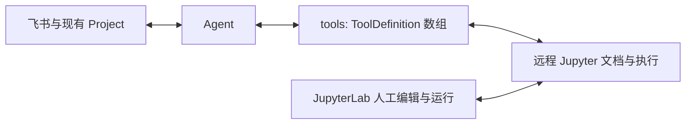

# 0.6.3：在现有 Project 中持续使用 Notebook

> Current integration: [optional Jupyter CLI/Skill](../jupyter-service.md).
> ChatAgent and service lifecycle have no Notebook integration. This document
> retains the stricter coordinator design goals; its historical checklist is
> not a claim about the Datalayer CLI or a 0.6.3 acceptance result. Remote stop
> is explicit through `jupyter stop`; manual Lab editing is outside the user's
> 0.6.3 acceptance scope.

[综合 issue #5214](https://github.com/hs3180/disclaude/issues/5214) 跟踪产品验收。当前已有候选实现和组件证据，完整飞书/远程 Notebook 体验尚未通过。历史实验与失败保留在 [证据记录](./jupyter-harness-evidence.md)及对应 PR 中。

## 用户体验

用户在已绑定 Project 的飞书话题中提出问题。Agent 在配置的远程 Jupyter 上使用同一份 Notebook，逐步写入分析、图表、来源和结论，并给出可访问入口。用户可以在 JupyterLab 直接修改代码、参数和正文，再回原话题继续；Agent 读取最新共享状态、保留人工文字，并修订同一研究。

关闭浏览器仍能执行并保存。停止、断连或重启后查询原运行，明确完成、失败、仍运行或未知。成果交付为同版本的 Notebook、HTML 和飞书摘要。

## 最小实现

业务只定义一份工具：名称、说明、输入/输出 Schema 和 `execute(input, context)`。`context` 提供取消信号及可选进度。接入细节见 [Agent 工具契约](./agent-tools.md)：DSH 原生 registry、Codex dynamic function、Pi 原生工具、Claude 内部 MCP 包装均由 adapter 负责。内置工具与外部 MCP 使用 Harness 自己的配置；公共查询接口不再要求业务选择工具来源或创建 SDK 对象。

DSH 是主要真实验收路径，其他现有适配器复用同一业务定义。首版不要求先完成所有 Harness 的真实验收。模型路由、Session ID 和调用 ID 属于 adapter；它们不成为 Notebook 身份或执行权限。

Project 只保存远程连接、Notebook 引用和恢复所需的执行记录。Notebook、kernel、Python 依赖及输出由远程 Jupyter 管理。disclaude 宿主只用 Node 客户端，不启动本地 Jupyter、不安装 Python 环境，也不同步整个 Project。

## 必须保留的行为

- 文档按远程服务和稳定文档身份关联；改名更新路径，复制产生独立身份。解除关联保留远程成果，切换 Project 不沿用旧授权。
- 从共享文档读取未落盘的人工编辑。按 cell ID、预期版本定点提交；同 cell 冲突返回最新状态，其他 cell 的改动保留，metadata/附件不丢失。
- 首版 Python、同 Notebook 独占 kernel，人工和 Agent Run 进入同一串行执行入口。交接控制权后，旧提交、旧输出写回和旧 `/stop` 失效。
- 每次执行记录原文档/cell/源码版本、kernel incarnation 和 runId。服务端接收 shell/IOPub、关联 parent message，处理 MIME/display 更新/clear/error并保存输出；源码变更后历史输出仍可查，但不能当作新版有效结果。
- Agent 取消阻止新工具操作并等待回调结束。远程运行通过原 runId 单独停止并核验实际执行；推理结束或收到 AbortSignal 不算 kernel 已停止。
- 断连、超时和重启先对账原运行；未知提交不自动重放。没有运行记录时，只有持久的 run-ID fence 才能证明迟到请求也不会执行。kernel 身份无法证实则报告内存未知。
- 大输出采用有限预览和产物引用，明确截断。图表保留原生 MIME，飞书提供关键静态预览；报告、导出和摘要绑定同一文档版本及已确认结果。
- 凭据只留在宿主配置，不进入模型、Project 引用或交付链接。Notebook 访问沿用 Jupyter 授权；实际设备可达的入口才算交付。HTML 预览需满足已记录的 sanitizer/CSP 条件，下载与浏览器预览分别验证。

## Issue 与 PR 分工

| Issue | 具体交付                              | 当前对应 PR                       |
| ----- | ------------------------------------- | --------------------------------- |
| #5215 | 一个工具定义入口、DSH 持久会话与取消  | #5244                             |
| #5216 | 固定远程连接、兼容栈与部署条件        | #5247、#5248                      |
| #5217 | 同一共享 Notebook 的引用与版本化编辑  | #5245、#5246                      |
| #5218 | 服务端执行、结果保存与可靠停止        | #5245、#5249                      |
| #5219 | 原 Project/飞书话题的工具、停止和续行 | #5246、#5250                      |
| #5220 | 可读报告、图表观察与同版本交付        | 待实现与验收                      |
| #5221 | 重启/断连对账、连接诊断和最终发行     | #5247、#5249、#5250，仍需完整验收 |

这些是工程分工，不是用户研究流程。复用现有 Project、会话与附件交付；不增加研究项目注册表、固定研究阶段或通用插件工厂。远程 Jupyter 的文档/执行协调只补实际用例所需的缺口。

## 产品验收

- [ ] 真实飞书提出问题，在远程 Notebook 形成代码、图表、来源和结论；同一话题返回同一文档。
- [ ] 用户亲自修改参数及 Markdown；Agent 读到未落盘修改，保留人工内容并给出对应的新结果。
- [ ] 同 cell 冲突、不同 cell 并发、运行中编辑、人工/Agent Run 和控制权交接分别符合上述行为。
- [ ] 关闭所有 Notebook 页面仍能完成并保存；实际 `/stop` 确认目标运行结束，随后在同一 kernel 继续研究。
- [ ] Agent 重启、Jupyter 断连/认证失效和 kernel 丢失均对账原身份，不盲目重放，不生成本地替代品，不删除远程成果。
- [ ] 无共享磁盘和 Project 本地 Notebook 时完成读写、执行和同版本 `.ipynb`/HTML 交付；实际设备能打开，图表及报告经过渲染核验。
- [ ] 明确数据/环境/种子后以干净 kernel 核验复现范围；不可复现的条件如实说明。纯定性研究保留来源与论证，无需强制计算。
- [ ] 最终候选的构建、回归、安装、兼容性和恢复检查通过；模拟、组件证据与产品验收分别记录。

截至 2026-10-03 的配置实例诊断：认证成功，但协调扩展尚未激活；部署入口、持久挂载及重启影响方案待明确。这是产品验收前置条件，旧本地探针和 CI 不完成该验收。

日常与候选默认 `gpt-6-luna`，禁止 Astra；#5215/#5219 真实模型验收显式 `gpt-5.6-luna` 并记录实际路由。生产短切保留配置/workspace、单机器人连接，验收后恢复并核验健康。PR 合并由用户执行。
